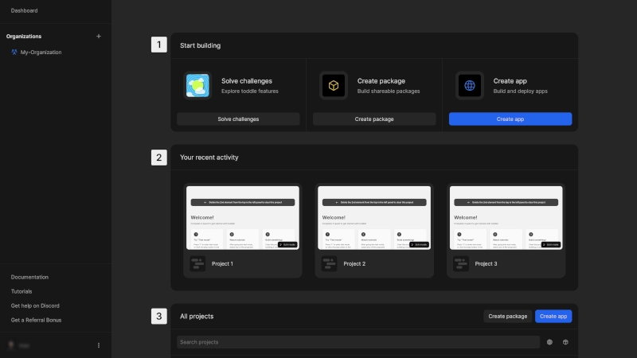
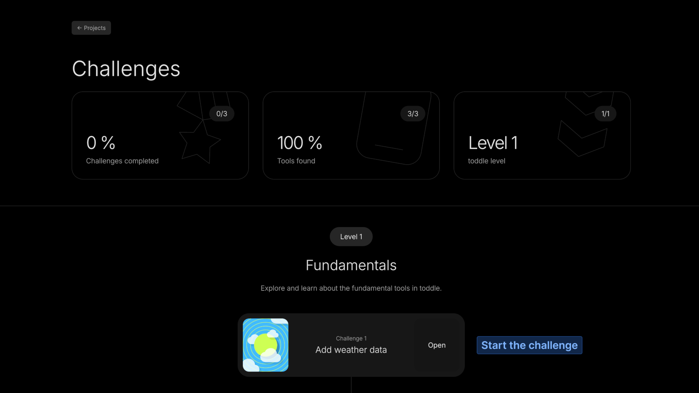

# Get Started with toddle
Toddle provides a flexible and intuitive development environment for building applications.

# Dashboard

The toddle dashboard includes the key sections:
1. **Start Building**: Quick action to start a new project or solve challenges to explore toddle features
2. **Recent Activity**: Quick access to your most recently edited projects
3. **All Projects**: View and manage projects from all of your organizations

# Projects in toddle
A project in toddle can be either an app or a package.
## Apps
These are full applications that can be used for web development, including websites, web apps and more. Since toddle is built on standard HTML, CSS and JavaScript, you can create anything from simple pages to complex interactive experiences.
## Packages
Packages are modular, self-contained collections of components or functions that can be used across multiple apps. They help keep your projects organized by separating reusable elements and logic. Packages are public, allowing other users to install and integrate them into their own projects.

::: dev
It's not possible to use packages in packages.
:::

# Explore toddle through challenges
To get hands-on with Toddle's features, try solving the challenges available on your dashboard. These guided exercises will introduce you to key concepts and help you become familiar with the platform.

