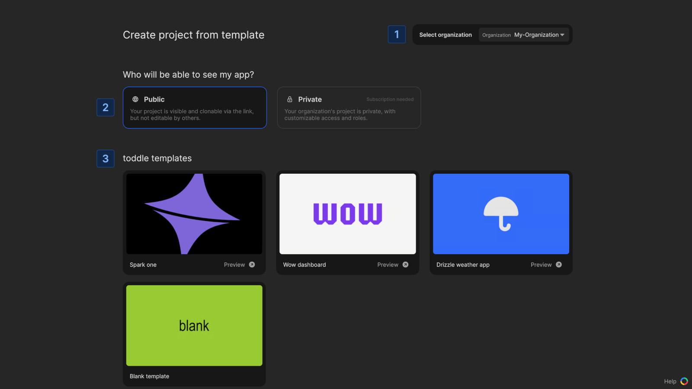
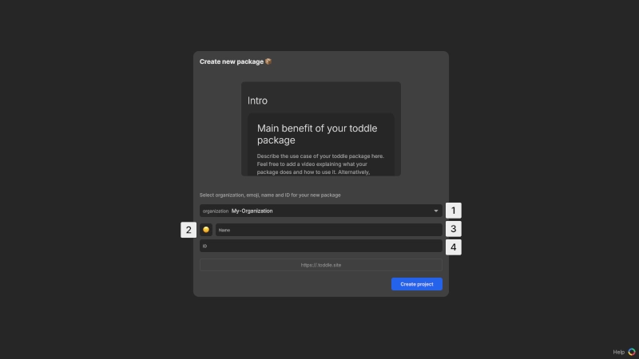

# Create a new project in Nordcraft

A project in Nordcraft can be either an [app](/get-started/overview#apps) or a [package](/get-started/overview#packages).

## Create a project from the dashboard

In the dashboard view, find the **Start Building** section. Click [kbd]Create app[kbd] or [kbd]Create package[kbd] to begin the creation process for the corresponding project type.

## Create a project from the organization view

In the organization view, at the top right of the project list, you will find the buttons to create an app or a package. Click on the relevant button to start the process.

## Create an app

1. **Select organization**: The organization is pre-selected based on your account settings
2. **Choose visibility**: Decide who should be able to see your app and select **public** or **private**
3. **Choose a template**:
   - Built-in templates: Choose from available Nordcraft templates
   - Community template: Pick from community-contributed templates

After selecting the template, the Nordcraft editor will open for you to start working.

## Create a package

1. **Choose organization**: The organization is pre-selected based on your account settings
2. **Select an emoji**: Choose an emoji to represent your package
3. **Enter name**: Type in the desired name for your package
4. **Adjust project id**: The id is automatically generated based on the package name, but you can adjust it as needed

After confirming the details, the package will be created and the Nordcraft editor will open for you to start working.

For more detailed instructions on packages, see the [creating and launching packages](/packages/creating-and-launching) guide.

## Visibility options

When creating a project you can choose between two visibility options:

- **Public**: Your project will be visible and clonable via a URL, but others cannot edit it
- **Private**: Your project is only visible within your organization, with customizable access and roles for different users

::: info
Private apps require a paid plan.
It is currently not possible to create private packages.
:::
