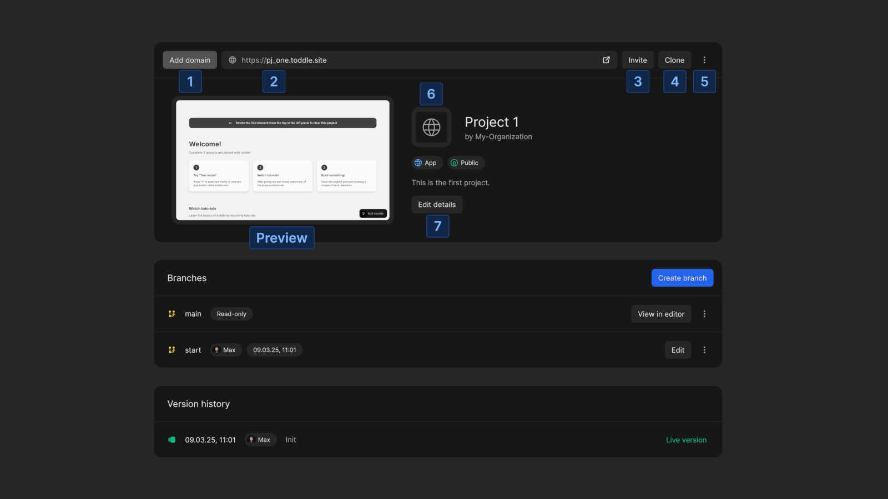
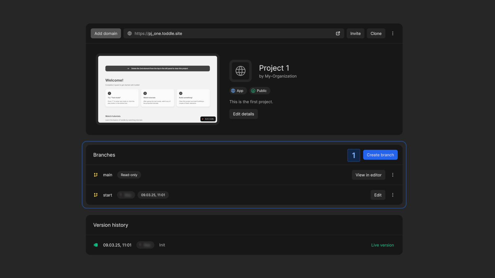

# Project Details
The project details page provides all essential information about your app or package. Here, you can manage settings, branches, track changes and invite collaborators.

# Settings
The settings section allows you to manage all configurations for your project.

Available Settings
1. **Add Domain**: customize the domain for your project (available only on a paid plan).
2. **Live preview**: Access the live preview of your project.
3. **Invite Members**: Add members from your organization to collaborate on the project.
4. **Clone Project**: Create a duplicate of the project in any of your organizations.
5. **Additional Actions**:
    - for **apps**: 
        - Change your app to **public**, where anyone can view it, or **private** with restricted access.
        - Delete your app.
    - for **packages**:
        - Delete your package. This is only possible before launch.
6. **Set a Logo**: Upload a custom project logo.
7. **Edit Details**: Modify the project ID, name and description.

# Branches
Using branches ensures a smooth and organized development process while keeping the main project stable.

Every project has a **main** branch, which is `read-only`. This branch reflects the current state in the editor but cannot be modified directly.

To make changes, you need to create a new branch.

## Create a New Branch
1. Click the `Create branch` button
2. Enter a name for the branch and confirm

The branch is created and you are automatically redirected to the editor to start working.

## All Branches
You can see all branches of your project, including who created them and when.

For each branch you have the following actions:
- **Edit**: Opens the branch in the editor to make changes.
- **View changes**: See an overview of all modifications in the branch. If the branch is outdated, conflicts will be highlighted for resolution before syncing with the main branch.
- **Preview**: Opens the live version of the branch.

# Version History
The Version History section provides an overview of all commits made to the project. This helps maintain control over project iterations and ensures that previous states can be rolled back when necessary.

The commit labeled `Live version` represents the current deployed version of your project. It corresponds to the main branch.

# Members
The members section lists all project members. If needed, you can remove a member from the project, except for the project owner.