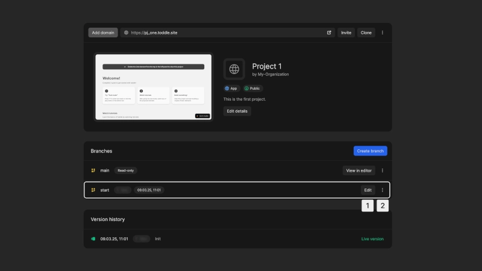
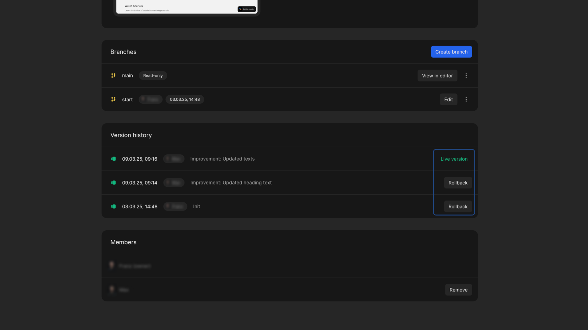

# Project details

The project details page provides information about your app or package. Here you can manage settings and branches, track changes, and invite collaborators.

## Settings

The project settings section allows you to manage your project configuration.

1. **Add domain**: Customize the domain for your project (available on paid plans)
2. **Live preview**: Access the live preview of your project
3. **Invite members**: Add members from your organization to collaborate on the project
4. **Clone project**: Create a duplicate of the project in any of your organizations
5. **Additional actions**:
    - for **apps**:
        - Change your app to **public**, where anyone can view it, or **private** with restricted access
        - Delete your app
    - for **packages**:
        - Delete your package (only possible before launch)
6. **Set a logo**: Upload a custom project logo
7. **Edit details**: Modify the project ID, name and description

::: warning
Publishing packages is permanement. You cannot delete a **package** after it has been launched.
:::

## Branches

Branches allow you to work on new features or fixes without affecting the main version of your project. If you're familiar with git version control, Nordcraft branches work in the same way.

Every project has a `main` branch that represents the current live version. The `main` branch is `read-only` and you cannot edit this branch directly. To make changes to your project, [create new branches](/get-started/branches-and-publishing#create-a-new-branch).

::: info
For detailed information on working with branches, see the [Branches and publishing](/get-started/branches-and-publishing) page.
:::

When selecting a project from your Nordcraft dashboard, you can view all active branches, with details about who created them and when.

The following actions are available for each branch:

1. **Edit**: Opens the branch in the editor to make changes
2. **Additional**:
    - **View changes**: See an overview of all modifications in the branch; if the branch is outdated, conflicts will be highlighted for resolution before syncing with the main branch
    - **Preview**: Opens the live version of the branch
    - **Delete branch**: Deletes selected branch

## Version history

The Version History section provides an overview of all commits (or "publishes") made to the project. This helps maintain control over project iterations and ensures that you can rollback to previous project states when necessary.

The commit labeled `Live version` represents the current deployed version of your project. It corresponds to the main branch.

## Members

The members section lists all project members. If needed, you can remove a member from the project. You cannot remove the project owner.
