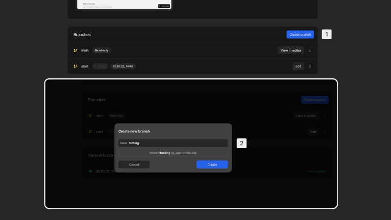
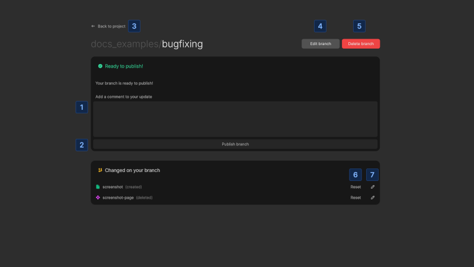

# Branches
Branches in toddle allow you to develop new features or fix issues without affecting the live version of your project. They provide a safe environment to make and test changes before making them available to users.

# Understanding branches
When you create a new project, toddle automatically creates a branch called `start` for you. The `main` branch represents what end users see. You cannot edit the main branch directly, but you can view it in the editor.

Branches work like branches on a tree:
- Your `main` branch is the trunk that users see
- New branches grow from this trunk
- When a branch is complete, it can be merged back into the trunk
- Once merged, the branch becomes part of the trunk

# Advantages of branches
Using separate branches for individual features or fixes provides several benefits:
- **Isolated development**: Work on specific features without impacting other work
- **Easier collaboration**: Reduce coordination overhead when multiple people work on the same project
- **Stability of live version**: The main branch remains stable with only completed and tested features
- **Simplified testing**: Test changes independently before publishing
- **Reduced risk of conflicts**: Minimize conflicts from simultaneous edits to the same code

::: tip
Keep branches small and short-lived. A branch should contain just a single feature like "add-color-picker" or "fix-dialog-styling-issue". Try to complete each branch within a single day's work.
:::

# Working with branches
## Create a new branch

1. Click the [kbd]Create branch[kbd] button on the [project details](/get-started/project-details) page
2. Enter a name for the branch and confirm

The branch is created and you are automatically redirected to the editor to start working.

You can have multiple branches open at the same time, each focusing on a different feature or fix.

## Preview a branch
You can preview your branch to test changes before publishing:
- Select your branch and click the [kbd]Preview[kbd] option
- This opens a preview at `branch-project.toddle.site`
- Share this preview link with others for feedback

## View changes
When working in a branch, you can see all modifications compared to the main branch:
- Click the [kbd]View changes[kbd] button in the [bottom bar](/the-editor/bottom-bar) of the editor or in [project details](/get-started/project-details)
- Review all modifications made in your current branch
- Identify any conflicts that need resolution before publishing

1. Enter a comment or description for your update
2. Publish your branch after entering in a brief comment
3. Navigate back to project details
4. Navigate back to this branch's editor
5. Delete your branch
6. Reset all changes for the selected page or component
7. Edit the selected page or component directly

## Publish changes
When you're ready to make your changes live:
1. Enter a short comment or description to your update
2. Click the [kbd]Publish branch[kbd] button

Your changes will be merged into the main branch and become immediately visible to users.

## Sync with main

Before publishing, your branch must be up-to-date with the latest changes in the main branch. If someone else has published changes since you created your branch, it will no longer be up-to-date, and you will need to sync with the main branch:
- Click the [kbd]Sync with main[kbd] button
- This pulls the newest version into your branch
- Once synchronized, you can [publish your changes](#publish-changes)

## Resolve merge conflicts

Merge conflicts occur when two branches have made different changes to the same section of code. When this happens:
1. toddle will identify and highlight the conflicting changes
2. You will need to decide which changes to keep:
    - Reset your branch's changes to use the main branch version
    - Reset main's changes to keep your branch's version
3. For each conflict, select the appropriate reset option

After resolving all conflicts, you can complete the [sync with main](#sync-with-main).

::: warning
When you reset a change, that version will be discarded. Make sure you understand what each change contains before deciding.
:::

::: tip
If you have changes you need to preserve when resolving conflicts, consider copying those changes to a new branch (which will automatically be in sync with `main`).
:::

## Roll back changes
If you discover serious issues after publishing and need to revert to a previous version of your project:
1. Go to the [version history](/get-started/project-details#version-history) section in [project details](/get-started/project-details)
2. Find the version you know worked correctly
3. Click the [kbd]Rollback[kbd] button next to that version
4. Confirm Rollback

This will immediately restore your live application to the selected version state, overwriting the current version.

::: warning
Rolling back is a significant action that affects your live application. Make sure you have selected the correct version before confirming.
:::
