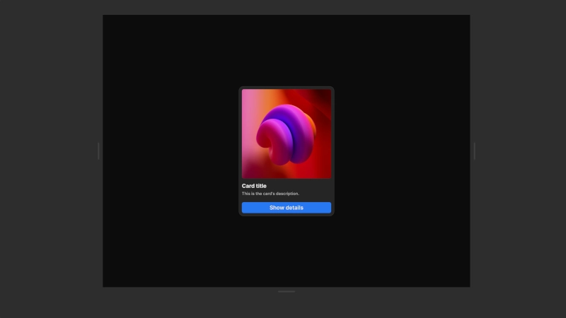

# Canvas

The canvas is the central workspace in the Nordcraft editor where you visually build and interact with your application.

{https://toddle.dev/projects/docs_examples/branches/main/components/screenshot-page?rightpanel=events&canvas-width=1077.6&canvas-height=800&mode=test}

# Interacting with elements

- **Highlighting**: In edit mode, hover your cursor over elements to highlight them
- **Selection**: Click on an element to select it, which highlights it in both the canvas and element tree
- **Deselection**: Press [kbd]Escape[kbd] or click on the background outside the canvas to deselect elements
- **Hidden elements**: Selecting a hidden element from the element tree makes it visible in the canvas, including any hidden parent elements

# Navigation and viewing

- **Panning**: Navigate the canvas by scrolling or by holding [kbd]Space[kbd] while dragging
- **Resizing**: Use the three handles on the canvas borders to test your application at different screen sizes

::: info
All links in the canvas open in a new tab to maintain editor synchronization. To test links as they'll work in your final application, use the preview functionality.
:::
