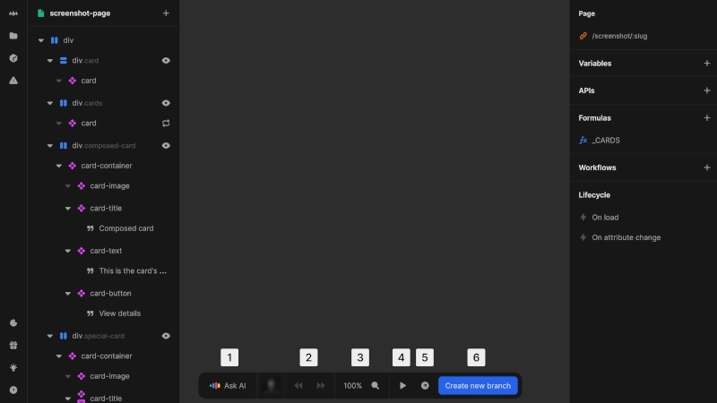

# Bottom bar
The bottom bar provides quick access to frequently used actions and tools in the Nordcraft editor.

{https://toddle.dev/projects/docs_examples/branches/main/components/screenshot-page?rightpanel=style&canvas-width=800&canvas-height=800}

1. **AI assistance**: Get help with through the "Ask AI" button
2. **Undo/Redo**: Revert or restore recent changes
3. **Zoom controls**: Adjust and view the current zoom level
4. **Test mode**: Toggle between editing and testing your application
5. **Preview**: Open the current page in a new browser tab to test
6. **View changes**: See all modifications made in the current branch

::: info
The [kbd]Export as web component[kbd] button is only available when editing components, not pages.
:::

::: tip
When testing interactive features, use preview mode for a more accurate representation of how your application will behave.
:::

# Collaboration
The user avatars displayed in the bottom bar show all users currently working in the same branch, enabling real-time collaboration awareness.