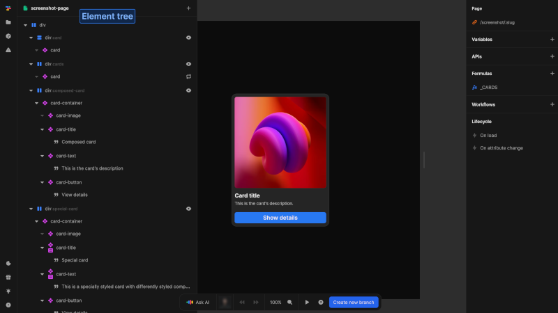
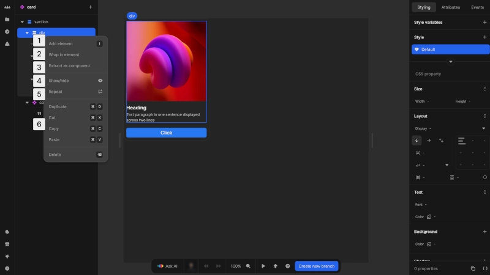
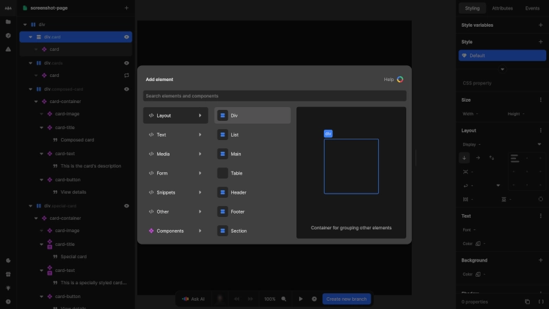

# Element tree
The element tree provides a structural overview of your project, displaying all elements in your page or component hierarchically. It enables efficient navigation, selection and organization of your project's building blocks.

{https://toddle.dev/projects/docs_examples/branches/main/components/screenshot-page?canvas-width=800&canvas-height=800}

## Navigation and selection
- Elements are named according to their HTML tag or component name
- Toggle visibility of child elements using the triangle icon
- Select elements by clicking on them, just as in the canvas
- Drag elements to reorder them within the structure

::: info
HTML element names always correspond to their real HTML tag.
:::

::: tip
Hold the [kbd]Alt[kbd] key while dropping a dragged element to copy it instead of moving it.
:::

## Context menu
Right-clicking an element opens a context menu with several actions.

{https://toddle.dev/projects/docs_examples/branches/main/components/card?canvas-width=800&canvas-height=800&selection=nodes.tf08THxvDvD2p9w3y5zhh&rightpanel=style}

1. **Add element**: Opens the element catalog
2. **Wrap in element**: Place the element inside a new parent element
3. **Extract as component**: Convert the element into a reusable component
4. **Show/hide**: Set a formula to control element visibility
5. **Repeat**: Apply a formula to create multiple instances from an array
6. **Standard operations**: Duplicate, cut, copy, paste and delete

# Adding elements
Add new element by
- selecting [kbd]Add element[kbd] from the context menu
- clicking the [kbd]+[kbd] button in the sidebar header
- using the hotkey [kbd]I[kbd] 

to quickly open the element catalog.

## Element catalog
{https://toddle.dev/projects/docs_examples/branches/main/components/screenshot-page?rightpanel=style&canvas-width=800&canvas-height=800&selection=nodes.m6MApQ1ZZSiZ5iH6kAUWE&elementCatalog=true}

The element catalog provides a collection of HTML elements and components organized by category. This makes it easy to find exactly what you need for your project. The catalog allows you to:
- Browse different element types grouped by functionality
- Search for specific elements and components
- View components from installed packages

Select an element to add it to your project. The element will be added as a child of the currently selected element or as the first child of the root element if no element is selected.