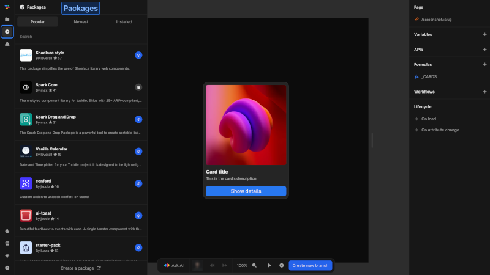

# Packages
Packages extend your project with reusable components and functionality created by the Nordcraft community. They save development time by providing pre-built solutions you can add to your apps.

{https://toddle.dev/projects/docs_examples/branches/main/components/screenshot-page?rightpanel=style&canvas-width=800&canvas-height=800&leftpanel=Packages}

# Finding packages
The packages panel organizes available packages in three tabs:
- **Popular**: Most frequently installed packages
- **Newest**: Recently published packages
- **Installed**: Packages currently used in your project

Use the search bar to find specific packages by name or functionality.

# Managing packages
Once you've found packages of interest, you can add them to your project and maintain them as needed. For detailed instructions on handling packages in your project, see the [packages](/packages/overview) page and the guide on [managing packages](/packages/managing-packages).