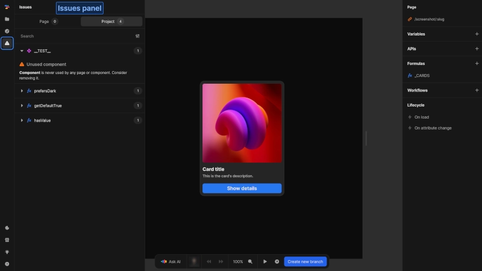

# Issues panel
The issue panel helps you identify and resolve problems within your toddle project. It provides an overview of all issues, allowing you to maintain code quality and improve project stability.

{https://toddle.dev/projects/docs_examples/branches/main/components/screenshot-page?rightpanel=style&canvas-width=800&canvas-height=800&leftpanel=Problems}

::: info
The issue panel is basically like a code linter for traditionally coded apps.
:::

# Accessing the issue panel
Access the issue panel by clicking the issue icon in the left sidebar of the editor.

::: tip
Regularly check the issue panel during development to catch and fix issues early.
:::

# Structure
The issue panel is split into two distinct views:
- **Current component/page**: Displays issues specific to the component or page you're currently editing
- **Project overview**: Provides a complete list of all issues across your entire project. Issues are bundled by component or page with:
    - Expandable sections with a complete list of issues
    - A badge indicating the number of issues

# Issue details
Each issue includes:
-  Severity level (info, warning, error) shown via icon
- Descriptive title
- Detailed description of the issue

Click on an issue to navigate directly to its location in your project.

::: info
Issues are also indicated with corresponding icons next to affected items, helping you quickly locate problem areas.
:::

# Finding specific issues
## Search functionality
Use the search bar to quickly find specific issues.

## Filtering options
Narrow down the displayed issues using filters for:
- Severity level: Filter by info, warning, or error status
- Issue type: Focus on specific categories, e.g. `No References` or `SEO`

::: info
The issue detection system is continuously improved to identify more potential issues.
:::

# Resolving issues
Addressing issues identified in the issue panel improves project stability, performance and maintainability. Good practice is to address issues during development rather than at the end of your project cycle.