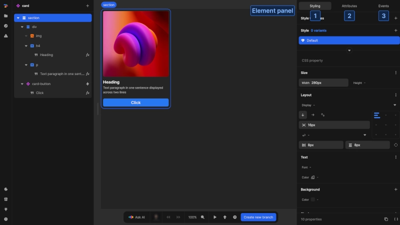
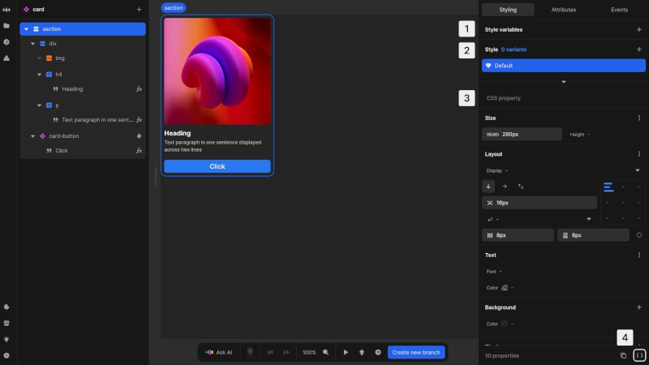
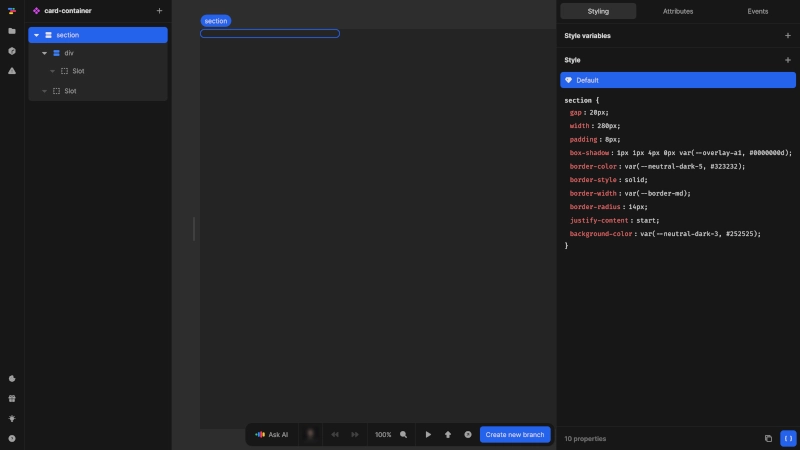
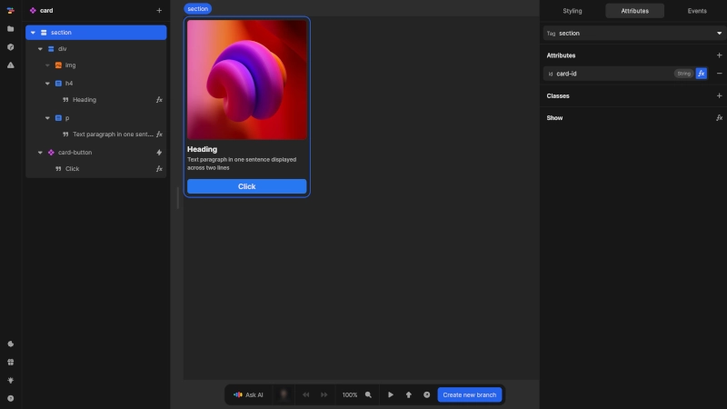
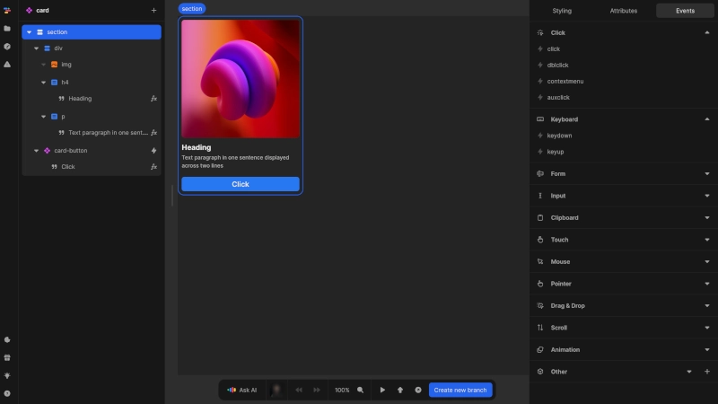

# Element panel
The element panel appears in the right side of the editor when an element is selected. It provides detailed control over the appearance, attributes and interactivity of the selected element.

{https://toddle.dev/projects/docs_examples/branches/main/components/card?selection=nodes.root&rightpanel=style&canvas-width=800&canvas-height=800}

When you select an element in the canvas or element tree, the element panel displays configuration options for that specific element. The panel has three primary tabs:
1. **[Styling](#styling-tab)**: Configure visual appearance and layout for the element and its children
2. **[Attributes](#attributes-tab)**: Set HTML or component attributes for advanced behaviors
3. **[Events](#events-tab)**: Define workflows triggered by user interactions with the element

# Styling tab
The styling tab allows you to control the visual appearance of elements and components.

{https://toddle.dev/projects/docs_examples/branches/main/components/card?selection=nodes.root&rightpanel=style&canvas-width=800&canvas-height=800}

1. Set [style variables](#style-variables)
2. Define [style](#style) variants
3. Set [CSS properties](#css-properties) for selected style variant
4. Use the [CSS editor](#css-editor) to configure styles with CSS code

## Style variables
Style variables provide a way to store and reuse values throughout your styles.
- Create and manage CSS style variables that can be referenced in your styles
- Set up CSS style variables in the formula editor to create dynamic, conditional styles
- Define the type, name and set a unit if needed (e.g. `px`)
- These style variables are available for use in CSS properties

## Style
The style section manages different visual variants of your element.
- Every element has a `Default` style applied
- Add variants with pseudo-classes (e.g. `:hover`, `:active`, `:focus-visible`)
- Create variants using defined classes (set in the attributes tab)
- Set up responsive styles with media queries for different screen sizes
- Combine classes, pseudo-classes and media queries for complex style variants
- When styling a component instance, you can select and style a component's class from the outside (see [component style overrides](/styling/conditional-styles#component-style-overrides))

## CSS properties
The CSS properties section provides a user-friendly interface to set styling properties.
- Properties are organized into logical groups like size, layout, text, background, shadow, effetcs, transform, transition and advanced
- Use the `Advanced` section to set any CSS property not natively supported
- Use the search field to quickly find specific CSS properties
- View the number of properties set in the current style at the bottom
- Copy styles or switch to the CSS editor view using buttons at the bottom of the panel

## CSS Editor

{https://toddle.dev/projects/docs_examples/branches/main/components/card-container?rightpanel=style&canvas-width=800&selection=nodes.root&canvas-height=800}

- The CSS editor provides a code view that replaces the CSS properties section
- Edit styles directly using CSS syntax
- All defined styles and their properties are displayed
- Changes made here are automatically applied to the standard view

This view is particularly useful for developers comfortable with writing CSS directly or for making multiple property changes efficiently.

# Attributes tab
The attributes tab allows you to configure HTML tags, attributes, classes and special behaviors like conditional display and repetition for the selected element.

{https://toddle.dev/projects/docs_examples/branches/main/components/card?selection=nodes.root&rightpanel=attributes&canvas-width=800&canvas-height=800}

## Element tag
- Select the HTML tag for your element (not available for components)
- Changing the tag allows you to modify the element's behavior while preserving its contents and styling

## Attributes
- Add attributes to the element by clicking the [kbd]+[kbd] button and entering a name
- Define attribute values directly or bind them to variables or formulas for dynamic content
- Some element tags have predefined attributes (e.g. `type` for input elements)
- For components, you can only set the attributes that have been specifically defined for that component

## Classes
- Add CSS classes to elements by entering a name and pressing enter
- Bind classes to conditions to apply them dynamically via the `fx` button
- Classes added here can be targeted in the styling tab as a style variant
- Classes cannot be added directly to components

## Special behaviors
- **Show**: Control element visibility through conditional formulas that evaluate to `true`/`false`
- **Repeat**: Generate multiple instances of an element based on array data, creating dynamic lists or grids

::: info
See the [show hide function](/formulas/show-hide-function) page and [repeat function](/formulas/repeat-function) page for more details.
:::

# Events tab
The events tab enables you to define interactive behaviors that respond to user actions, creating dynamic and responsive interfaces.

{https://toddle.dev/projects/docs_examples/branches/main/components/card?selection=nodes.root&rightpanel=events&canvas-width=800&canvas-height=800}

- Events are categorized into logical groups (click, keyboard, form, input, touch, etc.) for easier navigation
- Events with assigned workflows or actions are highlighted and appear in the **Active** section at the top
- Bind workflows, global actions, or trigger component events to any available event

For a complete list of available HTML element events, refer to the mdn documentation's [event reference](https://developer.mozilla.org/en-US/docs/Web/Events) on HTML element events.

::: tip
If you cannot find a standard JavaScript event, you can add it under the `Other` section.
:::