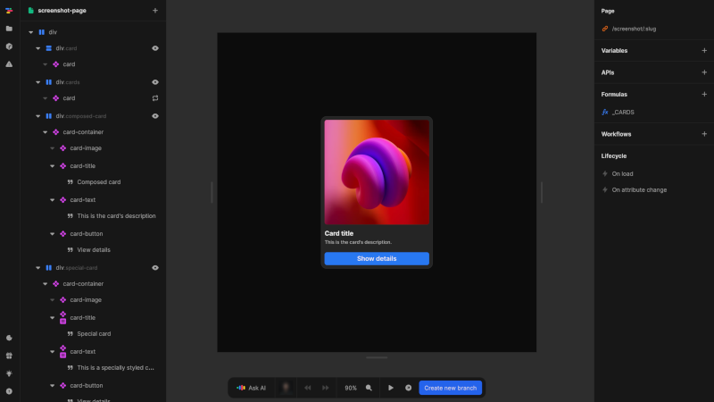

# Pages
Pages are the foundation of any Nordcraft application, representing distinct screens that users navigate to via unique URLs.

{https://toddle.dev/projects/docs_examples/branches/main/components/screenshot-page?canvas-width=800&canvas-height=800&rightpanel=events}

Pages in Nordcraft:
- Have their own URLs, allowing direct navigation and bookmarking
- Define metadata for SEO, social sharing, and browser display
- Can accept URL paths and parameters to create dynamic content
- Contain their own variables, APIs, and workflows
- Serve as containers for components and HTML elements
- Function as the top-level entry points for user interaction

Pages are essential to structured application development in Nordcraft. They should be used to:
- Create distinct sections of your application
- Implement navigation between different parts of your application
- Configure SEO-friendly metadata for each screen
- Handle URL-based parameters for dynamic content
- Organize related functionality into coherent screens

::: info
For more detailed information on creating and configuring pages, see the [Pages](/pages/fundamentals) section of the documentation.
:::