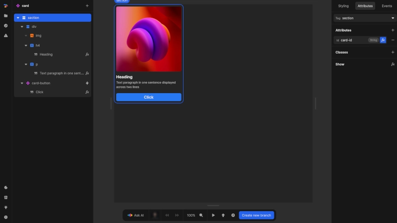

# Elements
Elements are the basic building blocks that make up the interface of your page or component in Nordcraft. They create the structure, content, and interactive parts of your application that users see and interact with.

{https://Nordcraft.dev/projects/docs_examples/branches/main/components/card?selection=nodes.root&rightpanel=attributes&canvas-width=800&canvas-height=800}

In Nordcraft, like in HTML, elements exist in a hierarchical structure. Each element (except for the root element) has a parent element, and many elements can contain children elements. This parent-child relationship creates what we call an element tree, with ancestor elements containing descendant elements.

# Types of elements
There are three distinct types of elements that you can add to your pages and components:
- **[HTML elements](#html-elements)**
- **[Text elements](#text-elements)**
- **[Components](#components)**

## HTML elements
HTML elements are the most common type of element used in Nordcraft. These elements are native to the browser, which means the browser inherently understands how to render and interact with them.

HTML elements are differentiated by their names or `tags`, each with specific meanings and behaviors, for example:
- Some tags like `<video>`, `<audio>`, and `` have built-in functionality for displaying media
- Others like `<button>`, `<input>`, and `<select>` provide functionality for user input
- Tags such as `<h1>`, `<header>`, and `<li>` have semantic meaning that communicates the content's purpose

::: info
Nordcraft deliberately uses standard HTML elements to ensure your application renders consistently across browsers, remains SEO-friendly and maintains accessibility standards. For comprehensive information about HTML elements, visit the [HTML Elements](https://developer.mozilla.org/en-US/docs/Web/HTML/Element) reference on MDN.
:::

### HTML element attributes
HTML elements can be configured using attributes. These provide additional information or modify the element's behavior:
- Common attributes like `id` and `class` can be applied to nearly all elements
- Element-specific attributes like `src` for media elements or `type` for input elements define their unique properties

You can modify an element's attributes in the [attributes tab](/the-editor/element-panel#attributes-tab) of the [element panel](/the-editor/element-panel).

::: info
For a complete list of HTML attributes, refer to the [HTML Attributes](https://developer.mozilla.org/en-US/docs/Web/HTML/Attributes) reference on MDN.
:::

### HTML element events
HTML elements can respond to user interactions through events. You can listen to all standard events on any element, and the editor allows you to add even non-standard events if needed. 

Events are configured in the [events tab](/the-editor/element-panel#events-tab) of the [element panel](/the-editor/element-panel).

::: info
For detailed information about all available events, see the [Events](https://developer.mozilla.org/en-US/docs/Web/API/Event) reference on MDN.
:::

## Text elements
Text elements in Nordcraft are specialized elements designed specifically for displaying text content.

Key characteristics of text elements include:
- They can only contain text and cannot have child elements
- They do not have attributes and cannot trigger events directly
- They inherit text styling from their parent element rather than being styled directly
- When selected, their content can be edited directly in the element panel
- Their content can be bound to variables or formulas for dynamic data display
- They can be conditionally displayed using the show/hide formula

## Components
Components are reusable custom elements that encapsulate their own structure, styling and behavior. They can be configured through attributes, styled with CSS variables and emit events to communicate with parent elements.

For more information, see the [components description](/building-blocks/components) in building blocks and the [Components](/components/fundamentals) pages of the documentation.

# Element limitations
There are several important limitations to be aware of when working with elements in Nordcraft:
- Text elements cannot have children
- Some HTML elements, such as ``, `<input>` and ` `, are designed to be self-closing and cannot contain child elements

::: info
For detailed information about HTML element constraints and proper nesting, refer to the [HTML Elements](https://developer.mozilla.org/en-US/docs/Web/HTML/Element) reference on MDN.
:::