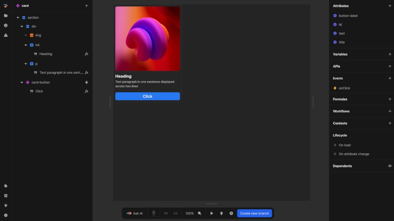

# Components
Components are one of Nordcraft's most powerful features, allowing you to create reusable, customizable building blocks for your application.

{https://toddle.dev/projects/docs_examples/branches/main/components/card?rightpanel=style&canvas-width=800&canvas-height=800}

Components in Nordcraft:
- Can be configured using attributes, contexts and CSS variables, similar to HTML elements
- Can emit events to communicate with parent elements
- Contain their own element tree, which can include any other element types, even other components
- Provide consistency across your application, as updates to a component propagate to all instances
- Help encapsulate logic and design, making your application more maintainable

Components are fundamental to efficient development in Nordcraft. They should be used to:
- Create reusable design patterns
- Encapsulate complex functionality
- Divide large interfaces into more manageable parts
- Ensure consistency throughout your application

::: info
For more detailed information on creating and using components, see the [Components](/components/fundamentals) pages of the documentation.
:::