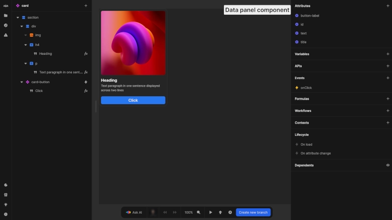

# Data panel

The data panel is the central hub for managing all data aspects of your pages and components in Nordcraft. It allows you to define variables, connect to APIs, create formulas, and establish workflows that power your application's functionality.

{https://editor.nordcraft.com/projects/docs_examples/branches/main/components/screenshot-page?rightpanel=style&canvas-width=800&canvas-height=800}

{https://editor.nordcraft.com/projects/docs_examples/branches/main/components/card?canvas-width=800&canvas-height=800&rightpanel=style}

::: info
The data panel is only visible when no element is selected. Press [kbd]Escape[kbd] or click on the background outside the canvas to deselect.
:::

## Structure

Pages and components have several data sections that provide essential functionality.

### Page

This section appears **for pages only**. Configure how your page appears in browsers and search results by setting the URL, title, description, and other metadata.

### Attributes

This section appears **for components only**. Define the interface for your component by creating attributes that can be set when using the component. You can set test values to preview how the component behaves in the editor.

::: info
These attributes are also the attributes of exported web components.
:::

### Variables

Store and manage state within your page or component. Variables can be initialized with default values, updated through actions and workflows, and used in formulas, e.g. to display dynamic content.

### APIs

Connect your application to external services and data sources by defining endpoints, configuring request parameters and HTTP methods, and handling responses.

### Events

Enable components to communicate with parent elements through custom events that can be triggered by internal actions and pass data upward.

### Formulas

Create reusable calculations and data transformations using Nordcraft's formula syntax to access data from variables, formulas, contexts and API responses.

### Workflows

Build multi-step processes to handle complex interactions by combining workflows and actions in sequence with conditional logic.

### Contexts

Subscribe to formulas and workflows exposed by parent components to access functionality while maintaining clean separation of concerns.

### Lifecycle

Control what happens at specific moments in your component or page lifecycle:

- On load: Actions that execute when the page or component is initially loaded or mounted to the DOM
- On attribute change: Actions that run when URL parameters (for pages) or attributes (for components) are modified

### Dependents

View all components that rely on the current component to track usage throughout your project and assess the impact of potential changes.

## Using the data panel

The data panel is fundamental to creating dynamic applications in toddle:

- Define your data model using variables and APIs
- Create formulas to transform and present your data
- Implement workflows to handle user interactions
- Configure lifecycle actions to initialize your application state
- Set up proper communication between components using events and contexts
