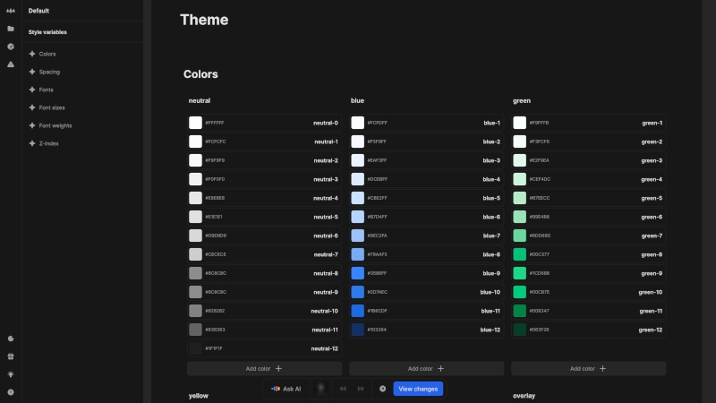

# Theme

The theme system in Nordcraft provides a centralized way to manage design tokens across your entire project. By defining colors, spacing, typography and other visual elements in one place, you can ensure consistent styling throughout your application.

{https://toddle.dev/projects/docs_examples/branches/main/themes/Default?canvas-width=800&canvas-height=800&rightpanel=style}

## Colors

Create and organize color palettes for your application in the color section:

- Create color groups by clicking the [kbd]Add group[kbd] button
- Define color variables with their specific values
- Group defined colors

## Spacing

Spacing variables help maintain consistent layout measurements throughout your application:

- Create dimension-related variables such as margin and padding
- Define spacing variables like `rounding-md`, `line-height-lg`, `button-height`
- Each variable can be assigned a specific value with unit (e.g., `1rem`, `4px`, `50%`).

## Fonts

Select and manage typography for your project:

- Choose from available Google fonts
- Add new fonts by clicking the [kbd]Add font[kbd] button

Once added, these fonts become available in the font dropdown menu in the [style panel](/the-editor/element-panel#style-tab).

### Add custom fonts

For fonts not available natively in Nordcraft, add them in your [page configuration](/pages/page-configuration). Navigate to the [head assets](/pages/page-configuration#head-assets) section to set up custom fonts.

::: info
Fonts added via page configuration will only be available on the specific page where you add them. To use custom fonts across your entire project, add them to each page that requires them.
:::

## Font sizes

Define a consistent type scale for your application:

- Create font size variables with descriptive names (e.g., `font-size-xs`, `font-size-base`, `font-size-lg`)
- Assign appropriate values to each size (e.g., `1rem`, `2rem`)

## Font weights

Establish consistent typography weights throughout your interface:

- Define font weight variables (e.g., `normal`, `bold`)
- Assign numeric values (typically `400`, `500`, `700`, etc.)

The numeric values correspond to standard font weight definitions, with `400` typically representing regular text and `700` representing **bold** text.

## Z-index

Z-index variables help manage the stacking order of elements:

- Create z-index variables for different interface layers (e.g., `app-header`, `backdrop`)
- Assign numeric values to establish a consistent stacking hierarchy
- Add new z-index variables by clicking the [kbd]Add z-index variable[kbd] button

A well-structured z-index system prevents unintended overlapping issues in complex interfaces.

## Using theme variables

All theme variables are available throughout your project:

- Access variables in the style panel of any element
- Select from dropdowns in the relevant property fields (e.g., color picker, spacing inputs)
- Use variables in formulas to create dynamic styling based on your theme

This approach ensures that changes to the theme automatically propagate throughout your application, maintaining design consistency with minimal effort.
