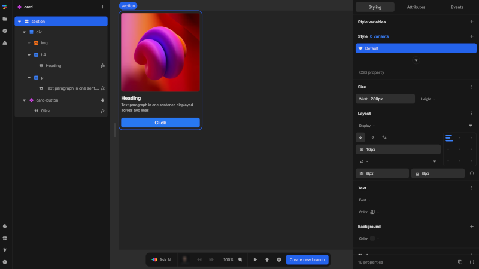

# Styles and layout

The styling and layout system in Nordcraft helps you write CSS visually, presenting the most commonly used CSS properties in the style panel. This approach lets you style elements visually without writing code while preserving traditional CSS flexibility. For more precise control, the CSS editor is also available.

## Adding CSS with the style panel

{https://toddle.dev/projects/docs_examples/branches/main/components/card?selection=nodes.root&rightpanel=style&canvas-width=800&canvas-height=800}

The style panel provides an interface for applying styles without needing to write CSS directly:

- Properties are logically grouped by categories (**Size**, **Layout**, **Text**, etc.)
- Each group contains specific controls for each property (color pickers, dropdowns, etc.)
- You can find properties using the search field at the top of the style panel
  - Type any property name in the search field
  - Select the property from the search results
  - You will be navigated to that property, ready to enter a value
- If needed, you can write CSS in the **Advanced** section

## Styling with the CSS editor

{https://toddle.dev/projects/docs_examples/branches/main/components/card-container?rightpanel=style&canvas-width=800&selection=nodes.root&canvas-height=800}

If you prefer writing CSS:

- Access the [CSS editor](/the-editor/element-panel#css-editor) by clicking the [kbd]{ }[kbd] button at the bottom of the [style panel](/the-editor/element-panel#style-tab)
- Write traditional CSS syntax for complete control over styling
- View all defined styles and their properties in one place
- Switch seamlessly between the style panel and CSS editor view, where your CSS will be reflected in the style panel properties

::: tip
The CSS editor is particularly useful for viewing all style variants and their associated properties at a glance.
:::

## Copy styles

You can transfer styling between elements:

1. Select the element with the styles you want to copy
2. Click the [kbd]Copy styles[kbd] button at the bottom of the style panel
3. Select the target element where you want to apply these styles
4. Paste the styles

## Layout in Nordcraft

### Flexbox layout

By default, Nordcraft uses the flexbox system for layout:

- Flexbox is a powerful layout system that enables complex arrangements
- It allows for flexible distribution of space among elements
- Elements can be aligned and distributed along both main and cross axes
- Direction, wrapping, and spacing can be precisely controlled

::: info
Flexbox provides many useful layout features. To learn more, see Josh W Comeau's [An Interactive Guide to Flexbox](https://www.joshwcomeau.com/css/interactive-guide-to-flexbox).
:::

### Text layout

When working with text content, Nordcraft defaults to **Text** layout:

- In CSS, this is called **flow layout**
- Text flows naturally according to the writing mode of the document (e.g. the `direction` such as `left-to-right` or `right-to-left`, the `text-orientation`, and more)
- Words wrap to the next line when they reach the container's edge
- This layout is optimized for reading and text-heavy content

::: info
For more information about flow layout, see the [flow layout documentation on MDN](https://developer.mozilla.org/en-US/docs/Web/CSS/CSS_display/Flow_layout).
:::
