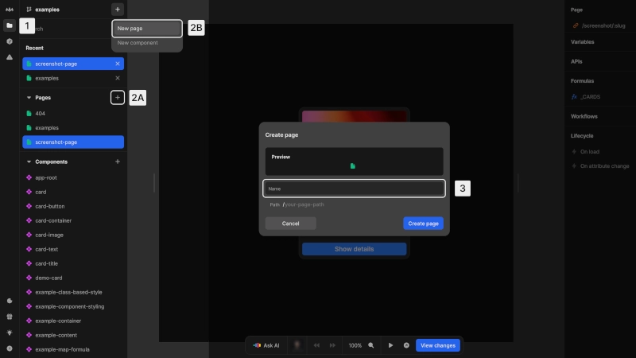

# Create a page

{https://toddle.dev/projects/docs_examples/branches/main/components/screenshot-page?canvas-width=800&canvas-height=800&rightpanel=style&leftpanel=Files}

To create a new page:

1. Open the [project sidebar](/the-editor/project-sidebar) by clicking the folder icon or using [kbd]Cmd/Ctrl[kbd] + [kbd]K[kbd]
2. **(A)** Find the "Pages" section and click the [kbd]+[kbd] button next to it or
   **(B)** Click the [kbd]+[kbd] button next to the branch name at the top of the [project sidebar](/the-editor/project-sidebar) and choose `New page`
3. Enter a name for your page and confirm with [kbd]Create page[kbd]
