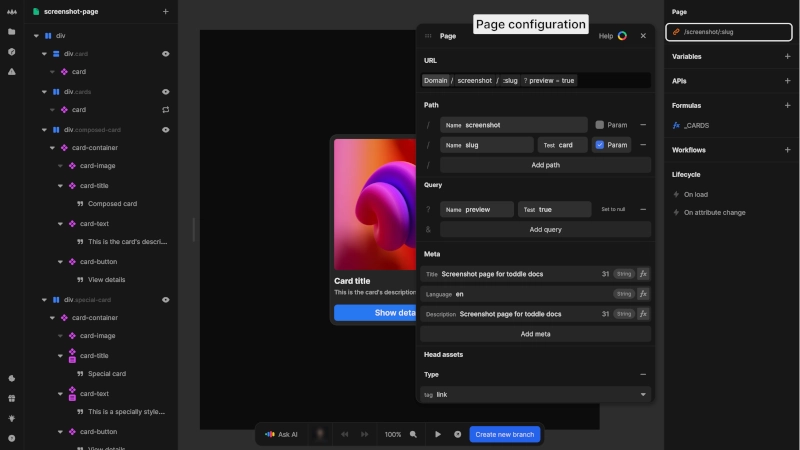

# Page configuration
To configure a page, select it in the [project sidebar](/the-editor/project-sidebar) and click on it in the **Page** section of the [data panel](/the-editor/data-panel).

{https://toddle.dev/projects/docs_examples/branches/main/components/screenshot-page?canvas-width=800&canvas-height=800&selection=route&rightpanel=style}

# URL structure
At the top of the page configuration panel, you will see a URL preview showing how your page's URL will appear, including domain, path segments and query parameters.

The URL configuration is divided into two main sections:
## Path
- Add path segments by clicking the [kbd]Add path[kbd] button
- For each path segment, provide a name
- Enable the [kbd]Param[kbd] checkbox to make a path dynamic
- Set a test value for development purposes 
- Remove paths using the [kbd]-[kbd] button
## Query
- Add query parameters by clicking the [kbd]Add query[kbd] button
- Name your parameters
- Set a test value for development
- Enable [kbd]Set to null[kbd] option when appropriate
- Remove parameters using the [kbd]-[kbd] button

::: tip
If you are not familiar with URL structure, check out the [blog post about URLs](https://toddle.dev/blog/urls-how-do-they-really-work).
:::

# Metadata
Each page in your application should have unique metadata to improve user experience and search engine visibility:
- **Title**: Appears in browser tabs and search results
- **Language**: Specify the language of your page content
- **Description**: Provides additional context for search engines and social media shares
- **Add meta**: Add additional specialized metadata as needed

Make sure your titles and descriptions are concise and clearly describe the page content.

You can bind any metadata value to formulas by clicking the formula button next to each field.

::: info
Custom `og:*` meta tags are only rendered for applications on a paid plan.
:::

# Head assets
Sometimes you need to add external resources to your page, such as third-party scripts or custom fonts.

In the URL panel under **Head assets**, you can:
1. Choose the resource type from the dropdown (script, link or style)
2. Provide content or reference external resources
3. Set additional attributes for the resource
4. Add multiple resources by clicking [kbd]Add external resource[kbd]

::: warning
Be extremely cautious when adding external scripts. Only add scripts from trusted sources as they will have full access to your page data.
:::

::: tip
When adding custom fonts or other resources, consider the impact on page load time. Each additional asset increases loading time and may affect user experience.
:::