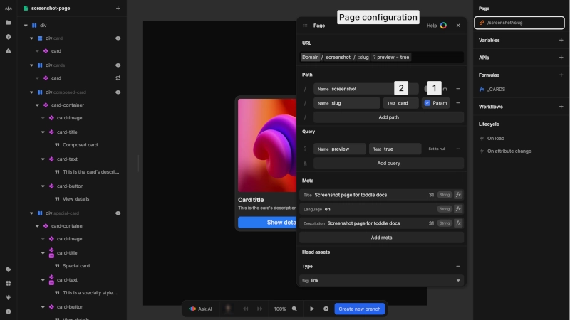

# Static and dynamic

# Static pages
Static pages contain content defined directly within toddle that remains consistent unless you publish updates. They:
- Have fixed content created directly in the editor
- Display the same information to all users
- Use predetermined URLs without variable path segments
- Don't require API calls to render content

Static pages are the default page type in toddle, ideal for content that doesn't need to change based on user input or external data.

# Dynamic pages
Dynamic pages display content based on data received from APIs or URL parameters rather than having static content defined directly in toddle. They use URL parameters to determine what content to display:
-  **Path parameters**: Define variable segments in your URL path
-  **Query parameters**: Add optional parameters after the `?` in the URL

{https://toddle.dev/projects/docs_examples/branches/main/components/screenshot-page?canvas-width=800&canvas-height=800&selection=route&rightpanel=style}

## Path parameters
To create a dynamic page:
1. Set a path as a parameter in the URL configuration. The parameter becomes available in the formula editor throughout the page
2. Set a test value to simulate different parameter values in the editor

For example, a blog page might use `/blog/:slug` where `:slug` is a parameter that determines which article to display.

::: info
toddle prioritizes **static** pages over **dynamic** ones when multiple pages match the current URL.
:::

## Query parameters
In addition to path parameters, you can define query parameters to pass additional information in the URL:
- Query parameters appear after a `?` in the URL (e.g., `?preview=true`)
- They're useful for optional settings or filters

## Working with URL parameters
When you create URL parameters, specific actions become available in the workflow editor:
- Update path parameters to change the URL without reloading the page
- Update query parameters to modify the current state

# When to use URL parameters
## Path vs. query parameters
- **Path parameters**: Use for essential page identification that affects navigation history
- **Query parameters**: Use for optional filters or settings that don't represent distinct navigation states

## URL parameters vs. variables
- **URL parameters**: Use when data should persist through page reloads and be shareable via links
- **Variables**: Use for temporary state or sensitive information not appropriate for URLs

Examples of data appropriate for **URL parameters**:
- Active tab selection
- Selected item in a list
- Visibility state of important UI elements

Examples better suited for **variables**:
- Form input values
- Confirmation dialog states