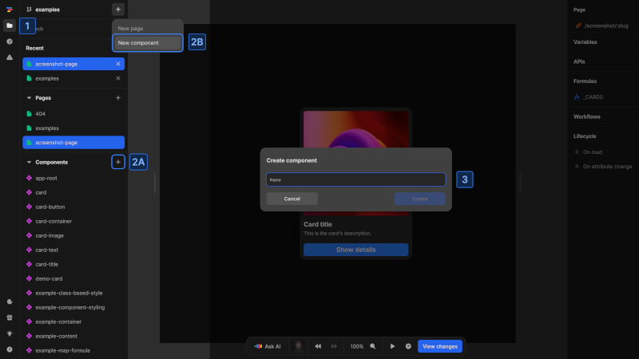
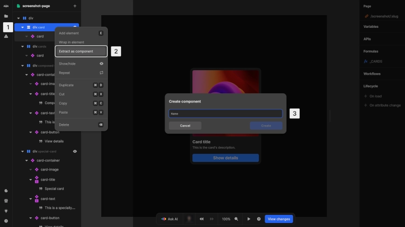

# Create a component

There are two ways to create components in Nordcraft:

- [Create from scratch](#create-from-scratch)
- [Extract existing elements](#extract-existing-elements)

## Create from scratch

{https://toddle.dev/projects/docs_examples/branches/main/components/screenshot-page?canvas-width=800&canvas-height=800&rightpanel=style&leftpanel=Files}

To create a new component:

1. Open the [project sidebar](/the-editor/project-sidebar) by clicking the folder icon or using [kbd]Cmd/Ctrl[kbd] + [kbd]K[kbd]
2. **(A)** Find the "Components" section and click the [kbd]+[kbd] button next to it or
   **(B)** Click the [kbd]+[kbd] button next to the branch name at the top of the project sidebar and choose [kbd]New component[kbd]
3. Enter a name for your component and confirm with [kbd]Create[kbd]

## Extract existing elements

{https://toddle.dev/projects/docs_examples/branches/main/components/screenshot-page?canvas-height=800&canvas-width=800&selection=nodes.m6MApQ1ZZSiZ5iH6kAUWE&rightpanel=style}

To convert existing elements into a component:

1. Select the element you want to convert in the [element tree](/the-editor/element-tree)
2. Right-click and select [kbd]Extract as component[kbd] from the context menu
3. Enter a name for the new component and confirm with [kbd]Create[kbd]

This method automatically:

- Creates a new component with the selected element's structure
- Replaces the original elements with an instance of the new component
- Preserves the original appearance and behavior

::: warning
If the extracted elements depend on variables or formulas from the original component or page, these connections will break after extraction. You will need to rearrange these dependencies.
:::
