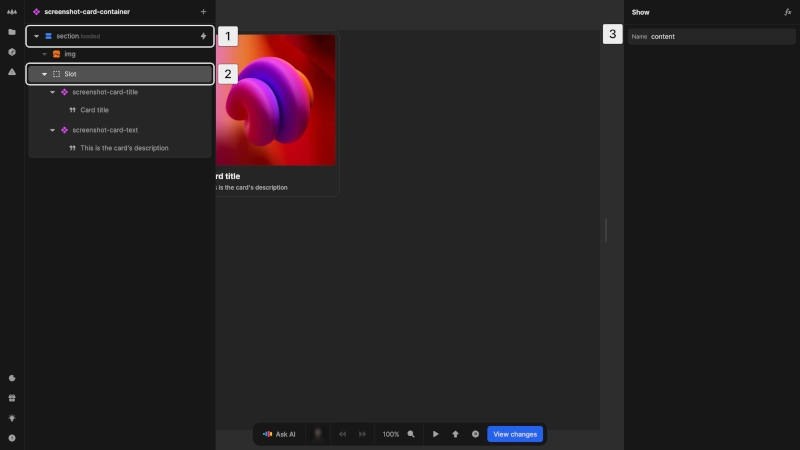
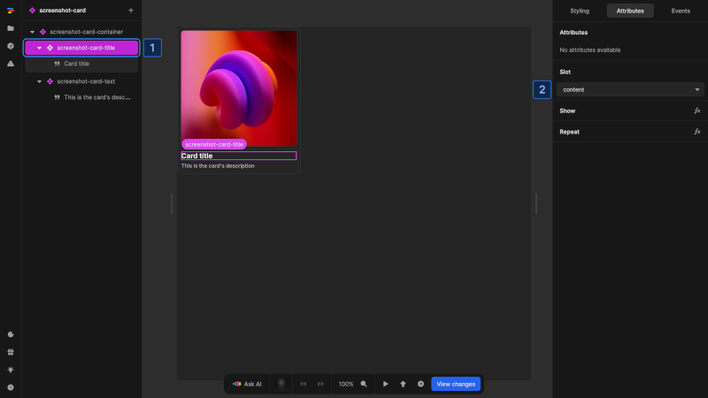
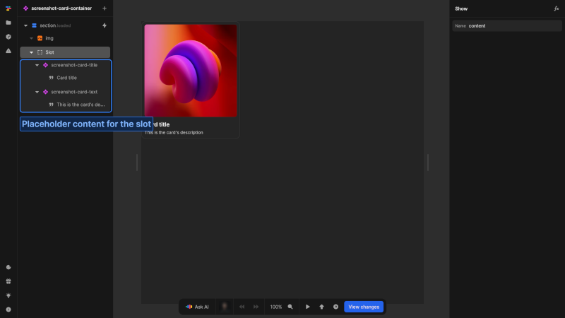

# Compositions

Component composition in Nordcraft refers to combining components in various ways to create more complex interfaces. By using different composition techniques, developers can build flexible, maintainable, and reusable UI structures.

The primary composition patterns in Nordcraft include:

- [Nesting components](#nesting-components): Adding components inside other components
- [Slots](#slots): Creating placeholders that can be filled with external content

@@@ example
componentUrl: https://docs_examples.toddle.site/.toddle/custom-element/example-component-compositions.js
editorUrl: https://toddle.dev/projects/docs_examples/branches/main/components/example-component-compositions?canvas-width=800&rightpanel=style&canvas-height=800
height: 26rem

The left card is built with fixed nested components and the right one with slots. Both create the same visual results but with different component architecture.
@@@

This example shows two different ways to build a component:
**Fixed nested structure**:

- Has predefined internal structure with built-in elements
- Structure and content controlled by the card component itself
- Developers cannot modify the structure directly when using it

**Slot-based assembly**:

- Provides empty placeholder areas (slots)
- Users must manually add elements into slots
- Different instances can contain different elements

# Nesting components

Nesting is the most basic form of component composition, where you add components inside other components:

1. Open a component in the editor
2. Add another component from the [element catalog](/the-editor/element-tree#element-catalog)
3. Configure the nested component's attributes as needed

Benefits of nesting include:

- Breaking complex interfaces into manageable pieces
- Reusing functionality at different levels of your application
- Creating clear relationships between UI elements

## Nesting considerations

When nesting components, consider the following:

- **Responsibility boundaries**: Each component should have a clear, focused responsibility
- **Data flow**: Parent components pass data down to child components through [attributes](/components/interface-and-lifecycle#defining-attributes) or [contexts](/contexts/overview). Child components send data up to parents through [events](/components/interface-and-lifecycle#setting-up-events) or [contexts](/contexts/overview)
- **Styling**: Parent components can [style the root element](/styling/conditional-styles#component-style-overrides) of nested components

As your application grows, you'll naturally develop deeper component hierarchies. While there's no strict limit to nesting depth, it's good practice to maintain clear boundaries of responsibility between components to ensure maintainability.

# Slots

Slots are a powerful feature in Nordcraft that allow components to receive and display content provided when the component is used. They act as placeholders that can be filled with content passed into the component from the outside.

The slot element is a fundamental part of Nordcraft's component specification:

- Like many core concepts in Nordcraft, slots build upon native web standards
- Slots create areas in your component that can be filled with external content
- They allow for flexible, composable component architectures
- They help maintain component encapsulation while enabling customization

::: info
The slot element in Nordcraft follows the web components standard. For more technical details, see the [MDN documentation on the slot element](https://developer.mozilla.org/en-US/docs/Web/HTML/Element/slot).
:::

::: tip
When [exporting a component](/components/export-a-component) as a web component, you can use slots like any other web component. You can insert anything, e.g. a React component, by defining the slot attribute on the element.
:::

## Adding slots to components

Slots are added to components like any other element using the [element catalog](/the-editor/element-tree#adding-elements):

1. Select where you want to add the slot in your component
2. Add a slot element from the [element catalog](/the-editor/element-tree#adding-elements)
3. Optionally add a name attribute (without a name, the slot is called `default`)

{https://toddle.dev/projects/docs_examples/branches/main/components/screenshot-card-container?canvas-width=800&rightpanel=attributes&selection=nodes.Iry7BeAO7AjcLcJEL-sPT&canvas-height=800}

## Naming

Slots in Nordcraft work with a naming system:

- **Default slot**: A slot without a name attribute that receives any unassigned content
- **Named slot**: A slot with a name attribute that receives content specifically targeted to it

{https://toddle.dev/projects/docs_examples/branches/main/components/screenshot-card?canvas-width=800&rightpanel=attributes&selection=nodes.47Ndqw5Wmw5WAwpiV13p8&canvas-height=800}

When adding content to a component with slots:

1. Select the element you want to place in a slot
2. In the [attributes tab](/the-editor/element-panel#attributes-tab), find the **Slot** section and select which slot should contain this element. Elements without a specified slot are placed in the `default` slot

## Placeholder content

Slots can contain default content that appears when no content is provided. This default content:

- Is shown when no matching content is provided
- Gets replaced when matching content is provided
- Helps create components that work out-of-the-box
- Provides visual cues during development

{https://toddle.dev/projects/docs_examples/branches/main/components/screenshot-card-container?canvas-width=800&rightpanel=events&selection=nodes.Iry7BeAO7AjcLcJEL-sPT&canvas-height=800}

# Comparing composition approaches

Both approaches - fixed nested components and slot-based assembly - involve nesting components within others. The key difference is in _how_ and _when_ this composition happens:

- With fixed nesting, composition happens when creating the component
- With slots, composition happens when using the component

**When to use fixed nested components:**

- You need guaranteed consistency in structure
- The internal elements will always be the same type
- You want to simplify usage by pre-assembling the structure
- The component represents a complete, predefined UI element

**When to use slot-based assembly:**

- You need flexibility in what content appears
- Different instances need different types of content
- You want to allow completely different elements in each instance
- You need to compose from existing components rather than building everything from scratch

Many complex components combine both approaches, using fixed nested components for core functionality and slots for customizable areas.
