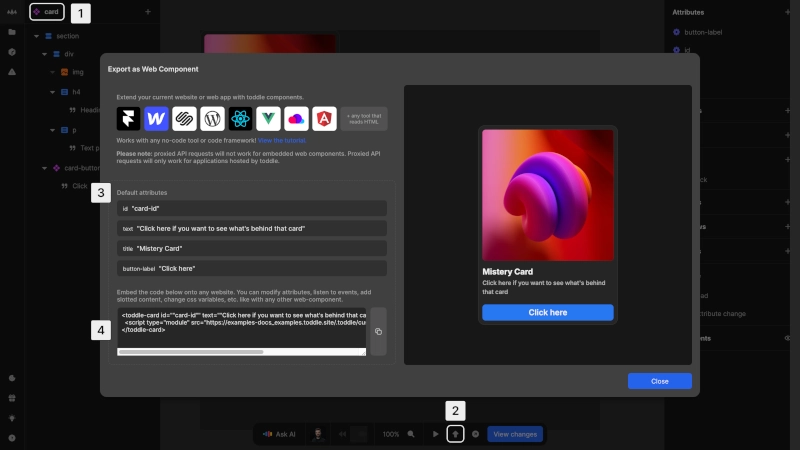

# Export a component
Components built in Nordcraft can be exported as standard web components, allowing you to use them in other projects and frameworks outside of Nordcraft.

## Export as web component

{https://toddle.dev/projects/docs_examples/branches/main/components/card?canvas-width=800&rightpanel=style&canvas-height=800}

To export a component from Nordcraft:
1. Open the component you want to export in the editor
2. In the [bottom bar](/the-editor/bottom-bar), click the [kbd]Export as web component[kbd] icon button
3. Set the default attributes
4. Copy the HTML code snippet for this web component

::: tip
For production use, always export your component from the `main` branch.
:::

Components in Nordcraft are built on the **Web Component API**, which means:
- They work in all modern browsers
- No compilation, custom build steps, or plugins are required
- They can be used directly in any HTML page or JavaScript framework

::: info
Web Components enable custom, reusable HTML elements. See the [MDN Web Components documentation](https://developer.mozilla.org/en-US/docs/Web/API/Web_components) for details.
:::

::: warning
Proxied API requests will not work for embedded web components. They will only work for applications hosted by Nordcraft.
:::

# Component naming requirements
Components in Nordcraft follow the naming restrictions of web components:
- Component names must contain at least two parts separated by a hyphen `-` (e.g., "user-card" or "nav-item"). This follows web component naming conventions.
- If a component name has only one part (e.g. "item"), Nordcraft will automatically prefix it with "Nordcraft" (resulting in "Nordcraft-item")
- Component names cannot contain any special characters
- Names are case-sensitive, but best practice is to use lowercase for compatibility