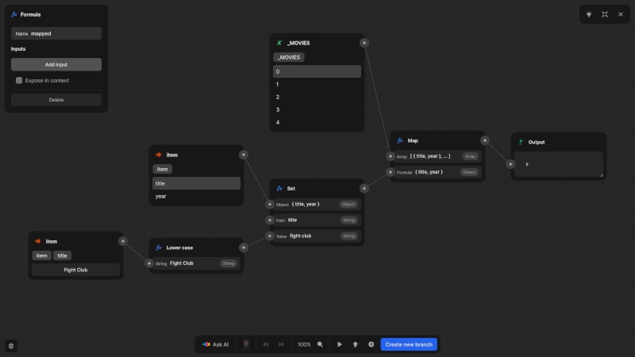

# Formulas

The formula editor is where you construct business logic for your application in Nordcraft. It provides a powerful way to transform data, perform calculations, and implement conditional logic throughout your application.

Formulas in Nordcraft are expressions that:

- Perform logical operations and data transformations
- Execute mathematical calculations
- Filter, search, and manipulate data
- Return consistent results for the same inputs

Formulas are [pure functions](https://www.geeksforgeeks.org/pure-functions-in-javascript), which means they:

- Have no side effects (don't modify external state)
- Always return the same output given the same input(s)
- Can be composed together to build more complex logic

::: info
A pure function always returns the same result for the same input values and doesn't change anything outside of itself, ensuring predictability and reliability.
:::

## The formula editor

{https://toddle.dev/projects/docs_examples/branches/main/components/example-map-formula?canvas-width=800&canvas-height=800&selection=formulas.2q0_dN&rightpanel=style}

The formula editor appears when editing formulas and wherever you see an [kbd]fx[kbd] button in the Nordcraft interface:

- In the [attributes panel](/the-editor/element-panel#attributes-tab) when binding values
- In the [Show](/formulas/show-hide-formula) and [Repeat](/formulas/repeat-formula) sections
- In the [style variables](/styling/conditional-styles#style-variables) panel
- In the [data panel](/the-editor/data-panel) when defining formulas

In the formula editor, you can:

- Reference variables, attributes, and other data
- Use built-in functions and operators
- Compose complex logic from simpler operations
- See a live preview of the formula output as you type and edit your formula

### Full-screen mode

For complex formulas, Nordcraft provides a full-screen view of the formula editor. It offers a larger canvas, better visibility of logic, and easier navigation for formulas with many operations.

::: tip
To open the formula editor in full-screen mode, click the four-arrow icon button in the top-right corner of the formula editor.
:::

## Formula foundations

Built on the same concepts as the web platform, Nordcraft offers many built-in formulas that closely align with similarly named JavaScript functions. Familiarity with these JavaScript concepts can help you create more effective formulas:

- [Array methods](https://developer.mozilla.org/en-US/docs/Web/JavaScript/Reference/Global_Objects/Array#array_methods_and_empty_slots) (map, filter, reduce, etc.)
- [Object methods](https://developer.mozilla.org/en-US/docs/Web/JavaScript/Reference/Global_Objects/Object) (keys, values, entries, etc.)
