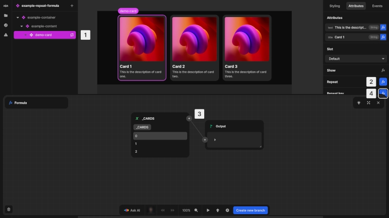

# Repeat formula

The repeat formula allows you to create multiple instances of an element based on a set of data. This powerful feature enables dynamic lists, grids and other repeating structures that automatically adapt to your data.

@@@ example
componentUrl: https://docs_examples.toddle.site/.toddle/custom-element/example-repeat-formula.js
editorUrl: https://toddle.dev/projects/docs_examples/branches/main/components/example-repeat-formula?canvas-width=800&rightpanel=attributes&selection=nodes.nQgi8KJ7OPxn9l5H0mML-.repeat&canvas-height=800
height: 19rem

Discover how the repeat formula is used to display multiple cards.
@@@

The repeat formula:

- Creates a new instance of an element for each item in a data array
- Makes the current item available as `Item` within the repeated element
- Automatically updates when the data changes
- Can be applied to any element or component

# Use the repeat formula

{https://toddle.dev/projects/docs_examples/branches/main/components/example-repeat-formula?canvas-width=800&rightpanel=attributes&selection=nodes.nQgi8KJ7OPxn9l5H0mML-.repeat&canvas-height=800}

To create dynamic content with the repeat formula:

1. Select the element you want to repeat
2. In the [attributes tab](/the-editor/element-panel#attributes-tab), click the [kbd]fx[kbd] button next to **Repeat**
3. Enter a formula that returns an `Array`. The element will be repeated for each item in the array
4. Set a [Repeat key](#optimizing-performance-with-repeat-key)

::: info
The output of your repeat formula must be iterable (an `Array` of items).
:::

## Accessing data in repeated elements

Within repeated elements, you can access:

- `Item`: The current item from the array
- `Index`: The position of the current item (starting from 0)

These repeat item variables allow you to customize each instance based on its data and position.

## Creating numeric ranges

If you want to repeat an element a specific number of times without dynamic data, you can use the `Range` formula. This is useful for pagination, grid layouts or any situation where you need a specific number of repeated elements.

@@@ example
componentUrl: https://docs_examples.toddle.site/.toddle/custom-element/example-repeat-range-formula.js
editorUrl: https://toddle.dev/projects/docs_examples/branches/main/components/example-repeat-range-formula?canvas-width=800&rightpanel=attributes&selection=nodes.nQgi8KJ7OPxn9l5H0mML-.repeat&canvas-height=800
height: 19rem

See how you can generate multiple cards using the Range formula.
@@@

# Optimizing performance with repeat key

To ensure efficient updates and tracking of repeated elements, add a **repeat key** formula that generates a unique identifier for each item. This key helps Nordcraft track items efficiently, preventing re-renders and improving performance. Use a stable value like a database ID, unique property or composite key for seamless updates when data changes.

::: warning
Using the index as a key prevents Nordcraft from making optimizations. Use a unique identifier, like a database ID or content hash. Duplicate keys disable performance optimizations.
:::

## How repeat key improves performance

The repeat key formula enhances performance in several ways:

- Enables Nordcraft to track specific items across renders
- Allows reuse of DOM elements instead of recreating them
- Prevents unnecessary re-rendering of unchanged items
- Maintains element state when items change position

This is especially important when:

- Working with large lists
- Implementing drag-and-drop reordering
- Frequently updating or filtering data
- Adding or removing items from the middle of a list
