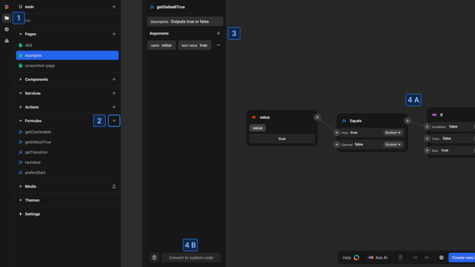
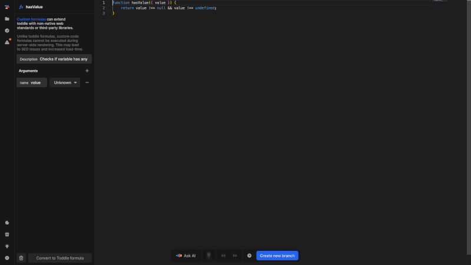

# Global formulas
Global formulas provide a way to create reusable calculations and logic that can be accessed from any page or component in your project. Unlike component-level formulas that are only available within a specific component, global formulas can be used throughout your entire application.

## When to use global formulas
Global formulas are ideal for:
- Common calculations used across multiple components
- Shared data transformations
- Utility functions like date formatting or number parsing
- Business logic that needs to be consistent throughout the application
- Complex operations that might be reused

Using global formulas ensures consistency in your application and reduces duplication of code.

# Create a global formula

{https://toddle.dev/projects/docs_examples/branches/main/formulas/getDefaultTrue?canvas-height=800&canvas-width=800&rightpanel=attributes}

To create a global formula:
1. Open the [project sidebar](/the-editor/project-sidebar) by clicking the folder icon or using [kbd]Cmd/Ctrl[kbd] + [kbd]K[kbd]
2. Find the **Formulas** section, click the [kbd]+[kbd] button and name your formula
3. Optionally add arguments as input parameters
4. Define your formula logic using either
    **(A)** The formula editor, or
    **(B)** Custom JavaScript code by clicking the [kbd]Convert to custom code[kbd] button at the bottom

Global formulas appear in the formula selection dropdown throughout your project, making them easily accessible from any component or page.

# Custom code formulas
Custom code formulas extend the capabilities of standard formulas by allowing you to write JavaScript directly. This enables you to implement functionality that isn't available through the built-in formula components.

{https://toddle.dev/projects/docs_examples/branches/main/formulas/hasValue?canvas-height=800&canvas-width=800&rightpanel=attributes}

## Custom code structure
In the custom code editor, your formula must have an entry function with the same name as your formula. This function receives two parameters:
- `args`: The defined input parameters passed to your formula
- `ctx`: The context object that provides access to Nordcraft-specific functionality

## Custom code considerations
When using custom code in global formulas, keep these important points in mind:
- **Pure functions**: Custom formulas should be pure functions without side effects. Given the same inputs, they should always return the same outputs without modifying external state.
- **Client-side only**: Custom code formulas only execute in the browser and not during server-side rendering. This can cause content shifts during page load and may impact SEO.
- **Synchronous execution**: Custom formulas must be synchronous. Don't use Promises, Fetch or other asynchronous APIs within global formulas.
- **Shadow DOM compatibility**: When components are exported as web components, use `ctx.root` instead of `document` to access DOM elements. This ensures compatibility with Shadow DOM encapsulation.

::: warning
Avoid adding side effects in custom formulas. Side effects can cause unpredictable behavior and should be handled by [actions](/actions/overview) instead.
:::

::: danger
Be cautious when pasting code snippets from external sources into custom formulas. Custom code can execute any JavaScript you add, which may introduce security vulnerabilities if the source is not trusted.
:::