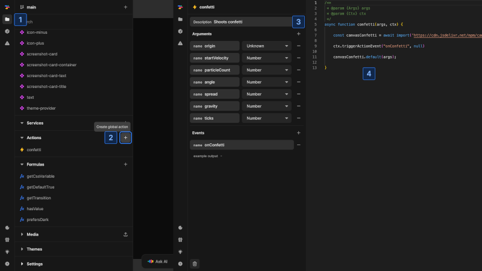
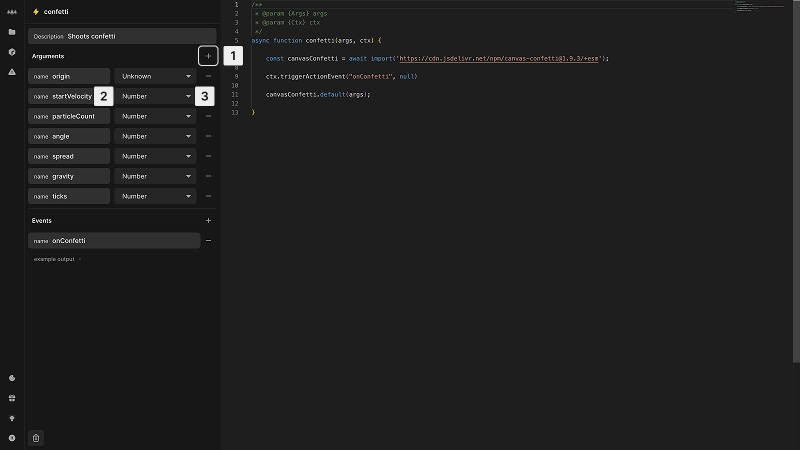
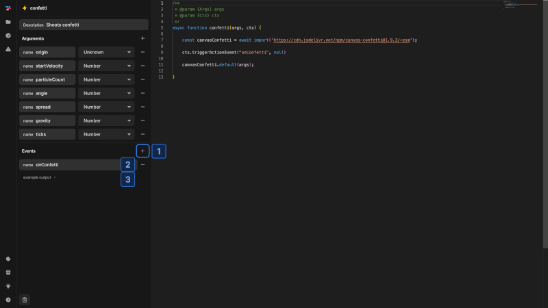

# Working with actions
This page covers the practical aspects of creating and using custom actions in Nordcraft.

## Create an action

{https://toddle.dev/projects/docs_examples/branches/main/actions/confetti?rightpanel=style&canvas-width=800&canvas-height=800}

To create a custom action:
1. Open the [project sidebar](/the-editor/project-sidebar) by clicking the folder icon or using [kbd]Cmd/Ctrl[kbd] + [kbd]K[kbd]
2. Locate the **Actions** section, click the [kbd]+[kbd] button and enter a name
3. Add a short description for your action
4. Write your JavaScript code in the editor

::: info
An action must contain a function with the same name as the action itself. This is the entry point.
:::

Custom actions have a specific structure with an entry function that receives two parameters:
- `args`: Contains all arguments passed to the action
- `ctx`: Provides access to Nordcraft-specific functionality

The function can return a cleanup function that will be called when the component unmounts.

## Configure arguments

{https://toddle.dev/projects/docs_examples/branches/main/actions/confetti?rightpanel=style&canvas-width=800&canvas-height=800}

To add arguments to your action:
1. Click the [kbd]+[kbd] button in the **Arguments** section
2. Enter a name for the argument
3. Select the argument type from the dropdown (`String`, `Number`, etc.)

In your code, access these arguments through the `args` parameter, using the names you defined.

## Set up events

{https://toddle.dev/projects/docs_examples/branches/main/actions/confetti?rightpanel=style&canvas-width=800&canvas-height=800}

To create events that your action can trigger:
1. Click the [kbd]+[kbd] button in the **Events** section
2. Enter a name for the event
3. Optionally provide example output to define the data structure

In your code, you can trigger events using the context object's `triggerActionEvent` method with the event name and data. When using the action in a workflow, you can then handle these events by adding actions to them.

# Action capabilities
When developing actions, keep these important considerations in mind:
- **Client-side only**: Actions only run in the browser, not during server-side rendering
- **DOM access**: Use `ctx.root` instead of `document` for DOM operations to ensure compatibility with Shadow DOM when components are exported as web components
- **Asynchronous code**: Actions can be [asynchronous](https://developer.mozilla.org/en-US/docs/Web/JavaScript/Reference/Statements/async_function) using `async/await` syntax or [Promises](https://developer.mozilla.org/en-US/docs/Web/JavaScript/Reference/Global_Objects/Promise)
- **Cleanup**: Return a function from your action to automatically clean up resources when the component that triggered the action is unmounted (e.g. [remove event listener](https://developer.mozilla.org/en-US/docs/Web/API/EventTarget/removeEventListener))
- **Error handling**: Actions should handle errors gracefully to avoid breaking your application

::: warning
When your action sets up ongoing processes like intervals or event listeners, always return a cleanup function to avoid memory leaks.
:::

# Use an action
Custom actions can be used just like built-in workflow actions. When [creating a workflow](/workflows/working-with-workflows), you can add your custom actions as nodes by selecting them from the **Project Actions** section. You can provide values for any arguments defined in the action and handle any events it might trigger.

Here is an example of a custom action in Norcraft. It demonstrates how the [canvas-confetti](https://github.com/catdad/canvas-confetti) library can be integrated to create a celebratory effect when triggered.

@@@ example
componentUrl: https://docs_examples.toddle.site/.toddle/custom-element/example-action.js
editorUrl: https://toddle.dev/projects/docs_examples/branches/main/components/example-action?canvas-width=800&rightpanel=events&selection=nodes.RVOI8hoh4CAD8XqcLfA4o.events.onClick&canvas-height=800
height: 4rem

This button triggers a confetti animation using a custom action. The action imports the [canvas-confetti](https://github.com/catdad/canvas-confetti) library and executes it when triggered. [kbd]Shoot Confetti[kbd] to see the action in effect.
@@@

::: danger
Be cautious when pasting code from external sources into custom actions. Actions can execute any JavaScript you add, which may introduce security vulnerabilities if the source is not trusted.
:::