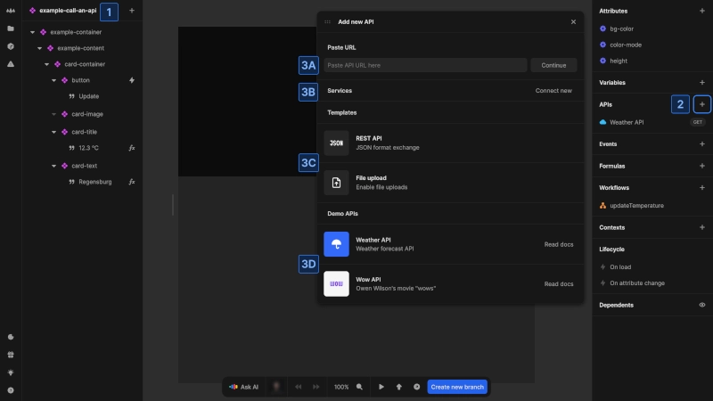
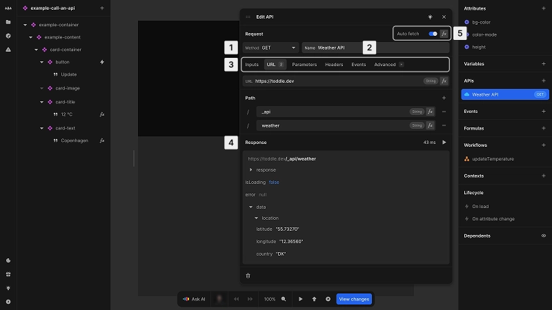
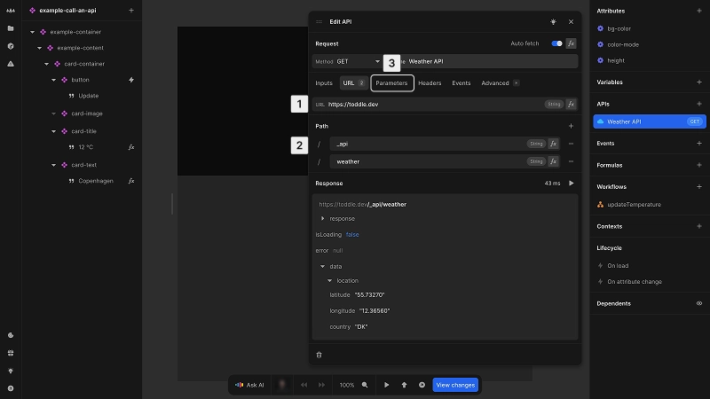
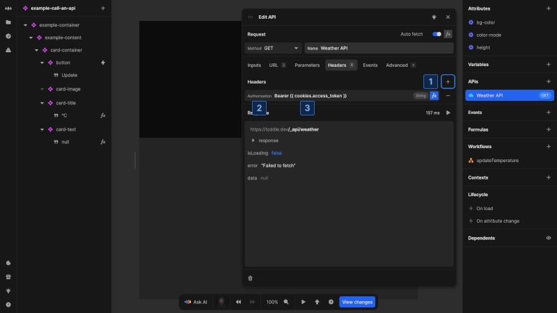
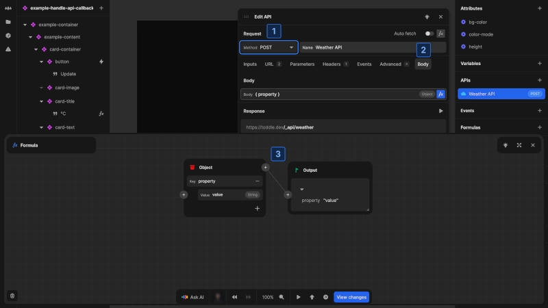
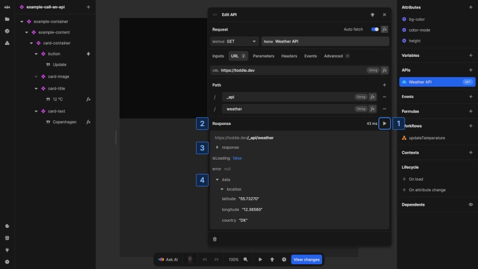

# Working with APIs

APIs are the primary way to connect your Nordcraft application to external data sources. They enable communication between your front-end application and back-end services, allowing you to fetch, send and manipulate data.

## Set up a new API

To create a new API connection in Nordcraft:

1. Select the component or page where you want to add the API
2. With no element selected, go to the **APIs** section of the [data panel](/the-editor/data-panel) and click the [kbd]+[kbd] button
3. You will see the **Add new API** panel with several options:
   **(A)** Enter a URL directly to create a custom API
   **(B)** Choose from connected services to access predefined endpoints (see [Services](/connecting-data/services))
   **(C)** Select from available templates to set up common APIs
   **(D)** Choose a Demo API

For beginners, the **Demo APIs** provide an excellent starting point to understand how APIs work in Nordcraft.

::: tip
Read our blog post on [REST APIs](https://blog.nordcraft.com/rest-apis-explained) if you're new to working with APIs.
:::

## Configure API requests

After creating an API, you will see the configuration panel with the following sections:

1. **Method**: Select the appropriate [HTTP method](https://developer.mozilla.org/en-US/docs/Web/HTTP/Reference/Methods) (`GET`, `POST`, `PUT`, `DELETE`, etc.)
2. **Name**: Give your API a descriptive name
3. **Configuration tabs**:
   - **Inputs**: Default values used when fetching data that can be overwritten when called from workflows
   - **URL**: Configure the base URL and path
   - **Parameters**: Configure query parameters
   - **Headers**: Set request headers for authentication, content type, etc.
   - **Body**: Define the request body for methods that support it (this tab is only visible for supported methods)
   - **Events**: Define workflows for `On success`, `On error` and `On message` events
   - **Advanced**: Access additional configuration options
4. **Response section**: View the latest response from the server
5. **Auto fetch toggle**: Control when the API automatically retrieves data

### Configure the request URL

Configure the endpoint URL to specify where your request should be sent.

The **URL** and **Parameters** tabs allow you to construct the complete request URL by configuring:

1. **Base URL**: the domain and protocol (e.g. `https://api.example.com`)
2. **Path**: the specific endpoint path (e.g. `/users/profile`)
3. **Query parameters** (in **Parameters** tab): key-value pairs that appear after `?` in the URL
   - query parameters refine the response without changing the endpoint path
   - parameters with `null` values are skipped

::: tip
For a detailed explanation of URL structure, check out the [blog post about URLs](https://blog.nordcraft.com/urls-how-do-they-really-work).
:::

### Set request headers

[HTTP request headers](https://developer.mozilla.org/en-US/docs/Web/API/Request/headers) provide additional information about the request that determine how the back-end server processes the API call.

To add a request header:

1. In the **Headers** tab, click the [kbd]+[kbd] button
2. Select or enter the header name:
   - `Content-Type`: Format of the request body (e.g. `application/json`)
   - `Accept`: Expected format of the response (e.g. `application/json`)
   - `Authorization`: Authentication credentials (e.g. `Bearer {{ cookies.access_token }}`)
   - `Cache-Control`: Caching directives (e.g. `no-cache`)
   - `X-Api-Key`: API key for authentication
   - `Accept-Language`: Preferred language for response
   - Type in any value and confirm with [kbd]Enter[kbd] for other headers
3. Provide a static value or click [kbd]fx[kbd] for dynamic values

::: info
The documentation for your particular back-end API will provide information on what HTTP request headers it accepts for each URL endpoint.
:::

### Configure the request body

Define the data to send in the request [body](https://developer.mozilla.org/en-US/docs/Web/API/Request/body) when the method supports it, such as `POST`, `PUT`, or `PATCH`.

To configure the body:

1. Ensure your method supports a request body
2. Navigate to the **Body** tab
3. Use the formula editor to define the data structure

::: dev
By default, the request body will be encoded as JSON unless you specify a different format using the [Content-Type](https://developer.mozilla.org/en-US/docs/Web/HTTP/Reference/Headers/Content-Type) header.
:::

### Auto fetch behavior

The auto fetch feature automatically triggers API requests based on certain conditions:

- When enabled, the API will fetch data when the component or page loads
- The API will automatically refetch when any formula values used in the request change
- This behavior can be controlled with a formula to create conditional fetching logic

Auto fetch is especially useful for `HTTP GET` requests where you want to display data immediately and keep it updated when related parameters change. Additionally, it enables server-side rendering (SSR) if configured in the **Advanced** tab.

### Test API requests

You can test your API directly in the editor:

1. For APIs with `Auto fetch` disabled, click the [kbd]Play[kbd] button to manually trigger the request
2. View the response in the **Response** section at the bottom of the API panel
3. Check the HTTP status code, response headers and body to ensure the API is working as expected
4. Check the returned data to ensure the API provides the correct information

The response section will display the data returned from the API, including properly formatted JSON if that is the response format.

## Next steps

After setting up your API:

- [Call the API](/connecting-data/call-an-api) in response to user actions
- [Access API data](/connecting-data/call-an-api#accessing-api-data) in your components
- Configure [authentication](/connecting-data/authentication) for secure data access
- Explore [advanced features](/connecting-data/advanced-api-features) for specialized requirements
