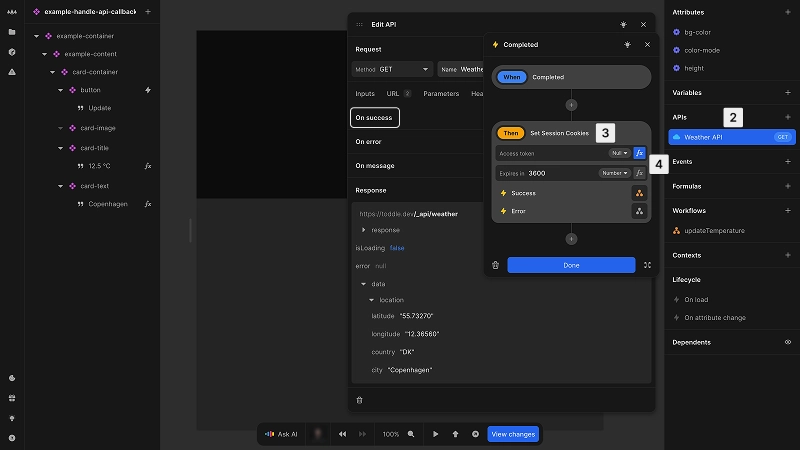
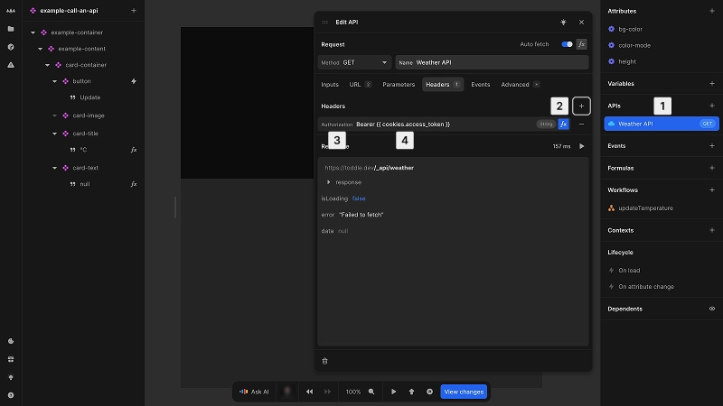

# Authentication

Authentication enables users to verify their identity, allowing you to control access to specific data and features in your application.

A typical authentication flow consists of these steps:

1. User provides credentials (e.g. a username and password)
2. Server validates and issues an access token
3. Client stores the token securely
4. Client includes the token with API requests
5. Server validates the token and grants access during API calls for data

This approach lets you implement secure authentication while keeping sensitive verification logic on your back end.

::: info
The "server" is the back-end application, the "client" is the front-end application in Nordcraft.
:::

In Nordcraft, authentication is handled through API connections, allowing you to:

- Choose your preferred authentication system
- Integrate with existing providers
- Follow security best practices
- Support various authentication methods

::: info
Authentication should always be handled by your back-end service. Nordcraft focuses on front-end development and provides secure ways to handle tokens received from authentication providers.
:::

## Storing access tokens

Access tokens represent user authorization and must be protected from unauthorized access. Store tokens in HTTP-only cookies for security:

- HTTP-only cookies cannot be accessed by client-side JavaScript
- HTTP-only cookies are protected against cross-site scripting (XSS) attacks
- HTTP-only cookies are automatically available in API requests via the Nordcraft proxy

There are two approaches for storing access tokens securely in Nordcraft.

### Set HTTP-only cookie directly

For login flows where users enter credentials (such as a username and password) directly in your application:

1. Create a workflow to call your authentication endpoint
2. Add the **Set Session Cookies** action to the `On success` callback event to set an HTTP-only cookie
3. Set the returned access token and expiration time in their respective inputs

::: warning
If you want to execute actions after the cookies were set (e.g. redirect to your main application), make sure that those actions are executed `On success` of the `Set Sessions Cookie` action to make sure the cookies were set correctly.
:::

::: tip
Learn more about using [HTTP cookies on the MDN documentation](https://developer.mozilla.org/en-US/docs/Web/HTTP/Guides/Cookies).
:::

### Use redirect authentication

For OAuth or third-party authentication providers that use redirects (like Supabase, Auth0 or Firebase):

1. Redirect users to the authentication provider to authenticate
2. Configure the provider to redirect back to your application at `/.nordcraft?access_token=<Your access token>`
3. Nordcraft automatically stores this token in a secure HTTP-only cookie
4. Optionally redirect users to a specific page after authentication using the query parameter `redirect_to=<URL>`

## Adding authentication to API requests

Once you have stored an access token, you will need to include it in subsequent API requests to authenticate the user:

For bearer token authentication:

1. Select your API in the [data panel](/the-editor/data-panel)
2. In the **Headers** tab of the API panel, click the [kbd]+[kbd] button to add a new header
3. Select `Authorization` as the header name
4. The value is set by default to output `Bearer {{cookies.access_token}}`, using `Concatenate` and `Get Http-Only Cookie` formulas; the value for the `access_token` will be replaced in the Nordcraft proxy with the actual token

::: info
API requests **mus**t be proxied through Nordcraft's edge network for HTTP-only cookies to be included. This is enabled by default in the **Advanced** tab of your API configuration.
:::

## Authentication in the editor environment

Working with authenticated features in the Nordcraft editor requires a specific setup to securely share authentication between preview and editor environments.

Follow these steps to develop authenticated features:

1. **Install browser extension**

   - [Chrome extension](https://chromewebstore.google.com/detail/toddle/hfhgjncckomifajhndceigiaiojhlllp)
   - [Firefox extension](https://addons.mozilla.org/en-US/firefox/addon/toddle/)

2. **Log in through preview page**

   - Authentication must first occur in the preview environment; you can open the preview through the [Bottom Bar](/the-editor/bottom-bar)
   - With the extension installed, your authentication cookies are securely copied to the editor

3. **Develop in the editor**

   - Once authenticated, you can build and test protected features directly in the editor
   - There is no need to log in separately for the editor environment

::: info
The browser extension is only required for development in the Nordcraft editor. Users of your published application will not need to install anything.
:::

## Security guidelines

Follow these security guidelines when implementing authentication:

- **Short token lifetimes**: Keep access tokens short-lived (hours, not days)
- **Use refresh tokens**: Implement refresh tokens for seamless token renewal; most back-end service providers support this
- **Secure token storage**: Store tokens in HTTP-only, secure cookies
- **Back-end token validation**: Ensure the back end validates tokens for every request
- **Proper logout**: Clear tokens on both client and server upon logout
- **Avoid client-side storage**: Never store sensitive data in `localStorage` or `sessionStorage`

::: danger
Do not store sensitive API keys or tokens in Nordcraft. Only store keys that are safe to store in a browser. Your back-end service provider documentation will advise you on which keys are safe to store, and which keys should not be exposed in browser environments.
:::
