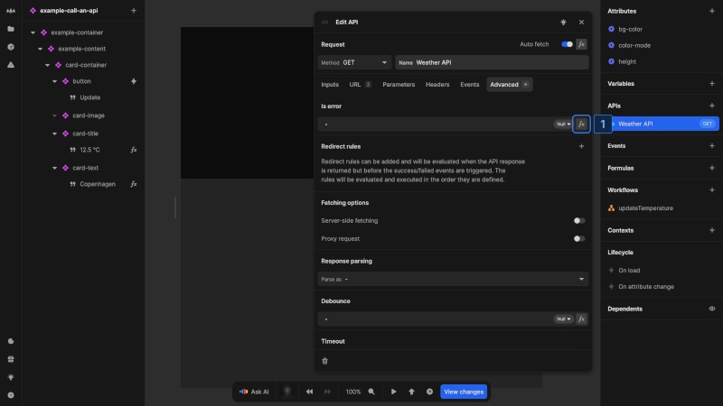
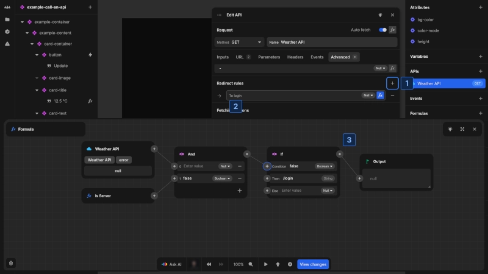
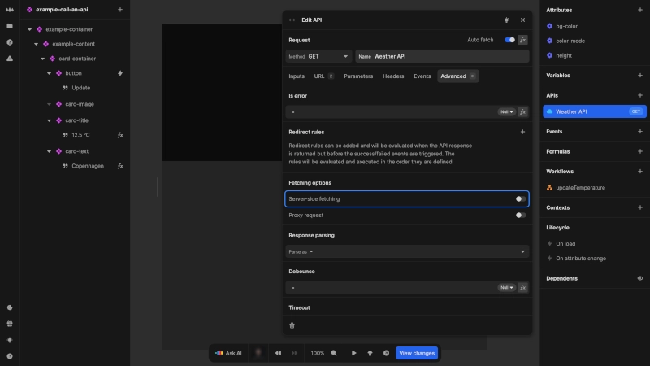
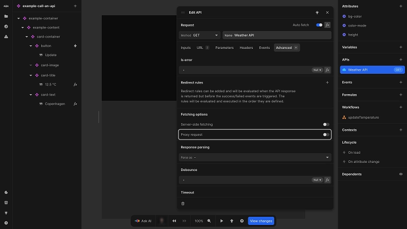
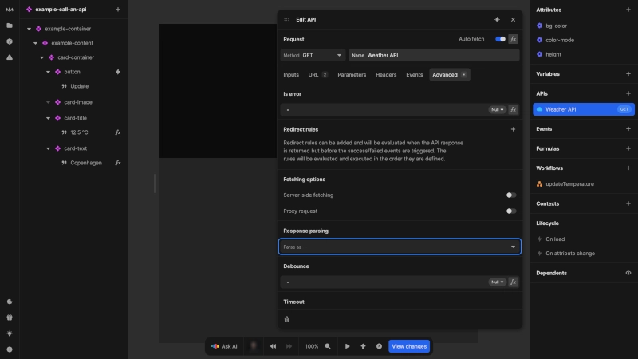
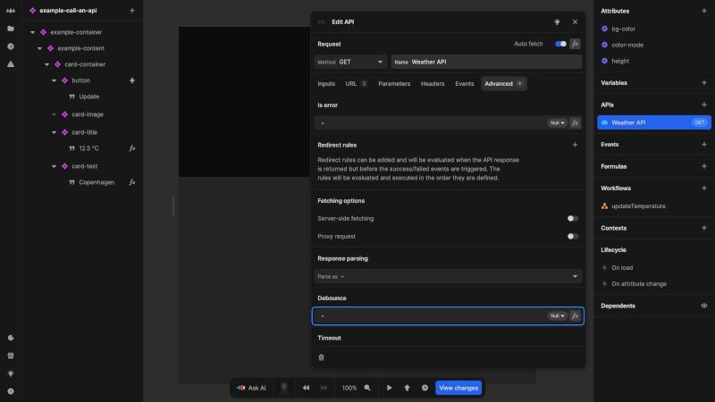
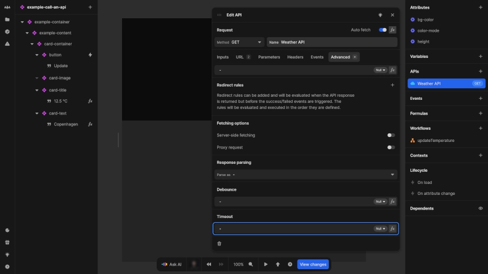

# Advanced API features

Nordcraft provides several advanced API features to give you fine-grained control over your API connections. You can configure the following features using the **Advanced** tab in the API configuration panel.

## Error definition

By default, Nordcraft treats API responses with status codes 400 and above as errors. However, some APIs communicate errors differently, such as [GraphQL APIs](https://graphql.org/learn/serving-over-http#response-format), which return errors in the response body with a 200 (Ok) status code.

The `Is error` formula allows you to customize what constitutes an error:

1. Click the [kbd]fx[kbd] button to open the formula editor
2. Create a formula that evaluates to `true` when the response should be treated as an error

When a response is identified as an error:

- It becomes available in the `error` property of the API
- The `On error` event is triggered instead of `On success`
- The `data` property is set to `null`

This customization is essential for properly handling errors in APIs that do not follow standard HTTP error conventions.

::: tip
Learn more about [HTTP response status codes on the MDN documentation](https://developer.mozilla.org/en-US/docs/Web/HTTP/Reference/Status).
:::

## Redirect rules

Redirect rules allow your application to automatically navigate users to different pages based on API responses. This is useful in several scenarios:

- Redirecting unauthenticated users to a login page
- Handling language or region-specific content availability
- Managing moved or deprecated pages

To configure redirect rules:

1. In the **Redirect rules** section, click the [kbd]+[kbd] button to add a new rule
2. Name your rule descriptively
3. Create a formula that evaluates to a URL or path when API response conditions are met; it should evaluate to `null` if the conditions are not met

Rules are evaluated in the order they appear, and the first matching rule determines the redirect destination.

### Server-side vs. client-side redirects

Redirects can happen in two ways:

- **Server-side**: occur **before** any content is sent to the browser, preventing page flashes
- **Client-side**: happen **after** the page has loaded in the browser

::: info
Server-side redirects are only available on paid plans.
:::

You can use the `Is Server` formula to create conditional logic based on where the code is executing. This allows different redirect behavior on the server versus in the browser.

::: info
When testing API responses in the editor, the `debug` section in `response` will show information about redirect behavior.
:::

## Fetching options

### Server-side rendering (SSR)

The **Server-side fetching** toggle controls whether an API request executes during server-side rendering before sending the page to the browser.

When enabled:

- API data is included in the initial page HTML
- Content appears immediately when the page loads
- No additional client-side API call is needed unless parameters change

SSR-enabled API requests have some requirements:

- They must have **Auto fetch** enabled
- They must return text or JSON data (check the `Content-Type` header)

::: tip
If an API takes longer than a few hundred milliseconds to respond, consider disabling SSR for this API to improve initial page load performance.
:::

### Proxy request

The **Proxy request** toggle determines whether API calls are routed through Nordcraft's edge network.

When proxying is enabled (default), your API requests pass through Nordcraft's edge network, providing several capabilities:

- **Authentication security**: Enables the use of HTTP-only cookies for secure token storage
- **CORS avoidance**: Eliminates [cross-origin resource sharing](https://developer.mozilla.org/en-US/docs/Web/HTTP/Guides/CORS) restrictions between domains
- **Request enhancement**: Allows Nordcraft to add headers or process responses

Proxying is particularly essential for authentication flows and third-party API integrations where direct browser-to-API connections would face security restrictions.

::: info
The Nordcraft proxy only processes request and response metadata such as headers. It does not read or modify the request or response body.
:::

## Response parsing

By default, Nordcraft automatically determines how to parse API responses based on the `Content-Type` HTTP response header. In some cases, you may need to override this behavior.

The **Parse as** dropdown allows you to select from several parsing options:

- **Auto**: Uses the `Content-Type` header to determine the parsing method (default)
- **Text**: Parses the response as plain text
- **JSON**: Parses the response as a JSON object
- **Event stream**: Parses as server-sent events (SSE)
- **JSON stream**: Parses as a stream of JSON objects (see the [NDJSON](https://github.com/ndjson/ndjson-spec) specification)
- **Image**: Handles the response as an image

This is particularly useful when working with APIs that return incorrect or missing `Content-Type` headers.

## Performance settings

### Debounce

Debouncing limits how frequently an API can be called, which is useful when API requests are triggered by rapid user actions like typing.

To set up debouncing:

1. Go to the **Debounce** field
2. Enter a value in milliseconds or use a formula

When an API call is triggered, Nordcraft waits for the specified time period before executing. If retriggered during this wait, the timer resets and starts again. The API call only executes after the specified time has elapsed without any new triggers.

Common use cases include:

- Search inputs where users type quickly
- Filtering controls that trigger on each selection
- Real-time form validation
- Preventing rate limit issues with external APIs

### Timeout

The timeout setting allows you to specify a maximum wait time for API responses.

To set a timeout:

1. Go to the **Timeout** field
2. Enter a value in milliseconds or use a formula

If the API does not respond within this time, the request will be canceled and an error will be triggered.

This is particularly important for:

- Preventing server-side rendering from hanging on slow API responses
- Improving user experience by failing fast when services are unresponsive
- Implementing fallback behaviors for unreliable APIs

::: tip
You can use different timeout values for server-side and client-side requests by using the `Is Server` formula.
:::
