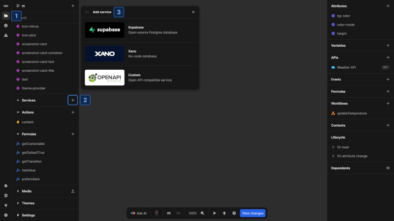
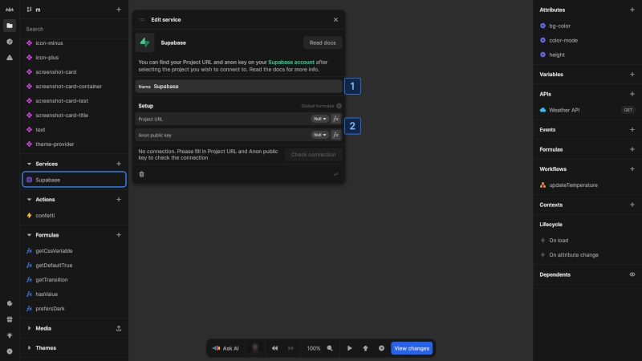
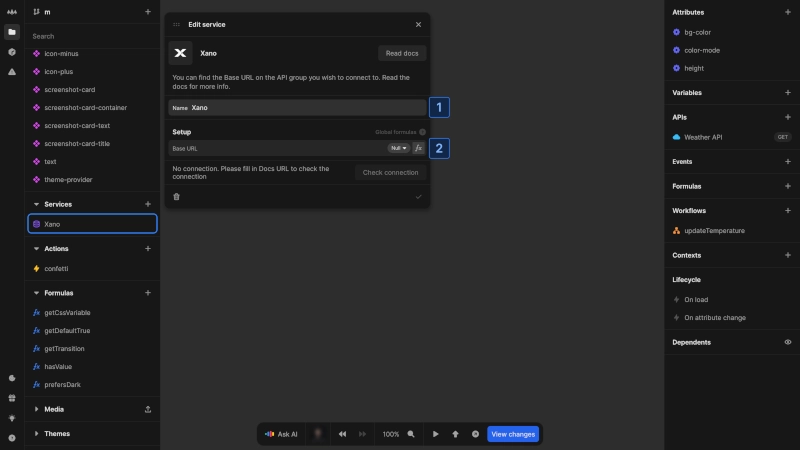
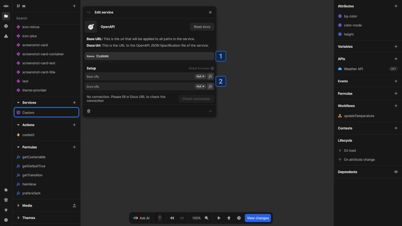

# Services

Services in Nordcraft simplify working with APIs by automatically retrieving endpoint details from backend providers. When you create a service connection, Nordcraft pre-fills the necessary information for new APIs, reducing setup time and minimizing configuration errors.

Nordcraft supports connections to a variety of backend services:

- **Supabase**: Open-source Postgres database with authentication and real-time capabilities
- **Xano**: No-code database and API builder
- **OpenAPI**: Any service using [OpenAPI Specification](https://swagger.io/resources/open-api) (v2 and v3)

# Add a service

There are two ways to add a service in Nordcraft:

## From the API creation flow

1. When creating a new API, click the [kbd]Connect new[kbd] button
2. Select the service you want to connect to from the available options

## From the project sidebar

1. Open the [project sidebar](/the-editor/project-sidebar) by clicking the folder icon or using [kbd]Cmd/Ctrl[kbd] + [kbd]K[kbd]
2. Navigate to the **Services** section and click the [kbd]+[kbd] button to add a new service
3. Select your desired service from the options

# Configure specific services

## Supabase

To connect to Supabase:

1. Enter a name for the service (defaults to "Supabase")
2. Provide the following credentials:
   - **Project URL**: The URL of your Supabase project
   - **Anon public key**: The anonymous/public API key for your project

You can find these credentials in your Supabase project settings. Once added, Nordcraft will validate the connection to ensure it can access the API documentation.

::: tip
To reuse configuration values throughout your project, click the [kbd]Make Global formula[kbd] button next to a field. This creates a [global formula](/formulas/global-formulas) that can be referenced anywhere else.
:::

## Xano

To connect to Xano:

1. Enter a name for the service (defaults to "Xano")
2. Provide the **Base URL** for your Xano API

The Base URL can be found in your Xano workspace:

- Select **API** in the left menu
- Choose the API group you want to use
- Click the [kbd]Copy base URL[kbd] button in the top right corner

After it's added, Nordcraft checks the connection to confirm it can reach the API documentation.

::: warning
Nordcraft currently only supports public Xano API documentation. If your API documentation is private, you will need to make it public.
:::

To make your API documentation public:

1. Go to your Xano API group
2. Click the [kbd]More options[kbd] button (three dots) in the top right
3. Select **Settings**
4. Change **Swagger (OpenAPI) Documentation** to **Public**

## Custom service (OpenAPI)

For services not natively supported by Nordcraft, you can add a custom service using **OpenAPI** specification:

1. Enter a name for the service (defaults to "Custom")
2. Configure the following:
   - **Base URL**: The root URL that will be applied to all paths in the service
   - **Docs URL**: The URL to the OpenAPI JSON Specification file of the service

Nordcraft performs a check after setup to confirm the API documentation is accessible.

::: info
Nordcraft currently supports [OpenAPI Specification](https://swagger.io/resources/open-api/) versions 2 and 3.
:::

# Use a service in an API

Once your services are configured, they simplify the API creation process by providing pre-defined endpoints from your backend:

1. When creating a new API, you will see your connected services
2. Choose the endpoint from the available options of your selected service
3. Nordcraft automatically pre-fills all request details (path, headers, parameters, body)
4. Adjust specific values as needed for your implementation

This approach streamlines API creation by leveraging the schema information already defined in your backend service.

# Benefits of services

Connecting to services offers several advantages:

- **Reduced configuration time**: Automatically populate API endpoints with correct paths and parameters
- **Consistency**: Ensure proper formatting for requests based on the service's documentation
- **Discovery**: Easily browse available endpoints without referring to external documentation
- **Maintainability**: When your backend service changes, updating the connection in one place applies across all related APIs

Services help bridge the gap between frontend and backend development, making it easier to maintain a clean separation of concerns while ensuring proper integration.
