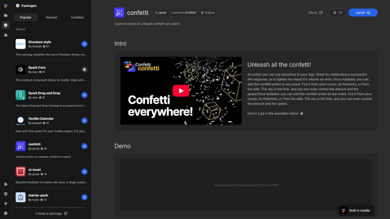

# Packages

Packages extend your Nordcraft projects with reusable components and functionality. They help you save development time and maintain consistency across projects.

::: dev
Packages in Nordcraft work similar to NPM packages. They can contain pure logic, visual elements or both.
:::

## Browsing packages

You can find the [kbd]packages[kbd] button in the [left sidebar](/the-editor/overview#left-panel). The packages panel organizes available packages into three tabs:

- **Popular**: Most frequently installed packages
- **Newest**: Recently published packages
- **Installed**: Packages currently used in your project

Use the search bar to find specific packages.

## Package details

Click on any package to view its detailed information page, which includes:

- Documentation explaining the purpose and functionality of the package
- Live interactive examples
- Instructions for using components, actions, and formulas
- Details about available attributes, events, and configurations
- Implementation examples and use cases

You can give a star to packages you find useful by clicking the star icon next to the [kbd]install[kbd] button. Stars contribute to the package's ranking in the Popular tab.

Additionally, you can clone any package by clicking the [kbd]clone[kbd] button, which creates a copy of the package in your account that you can modify.

## Package accessibility

All packages in Nordcraft are public, meaning:

- Everyone can browse and use any published package
- Anyone can install packages into their projects
- All packages can be cloned to learn from or modify
- Any user can create and publish their own packages

::: info
You cannot make a package private at this time.
:::

## Benefits of packages

Break down your project into well-defined packages to:

- Improve organization and code structure
- Promote modularity and reusability
- Make code easier to maintain
- Share specific functionalities across projects
- Contribute to the Nordcraft developer community and benefit from it
