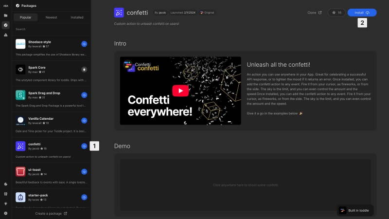
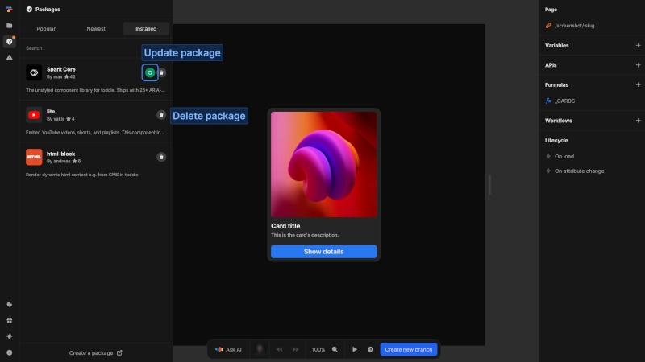

# Manage packages
Once you have found packages that enhance your project, you can easily install, update, and manage them.

# Install a package

Add a package to your project by:
1. Clicking the install button next to a package in the left panel or
2. Using the install button in the top-right corner of the package details page

Once installed, package's components, actions, and formulas become available throughout your project:
- **Components** appear in the element catalog under `Components`
- **Actions** become available in workflows and events
- **Formulas** can be used anywhere formulas are supported

# Manage installed packages
The `Installed` tab in the packages panel shows all packages currently used in your project.

## Update a package
When an installed package has updates available, a green update icon appears next to it. Click this icon to install the latest version.

::: warning
Updating a package while in the main branch immediately applies changes to your published project. This may cause unexpected behavior or break your live version.
:::

::: tip
Always create a new branch before updating packages. This allows you to test your application with the updated package and resolve any issues before publishing.
:::

## Uninstall a package
Uninstall a package by clicking the trash icon next to it in the packages list or on the package details page.

::: info
Removing a package will remove access to its components, actions and formulas. Any instances already used in your project will need to be replaced.
:::