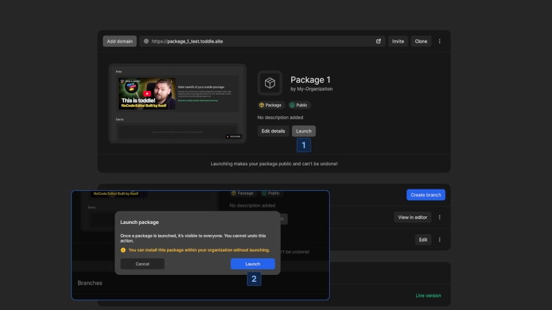

# Creating and launching packages

Packages are collections of components, formulas, and actions that can be shared across Nordcraft projects. The package repository grows with the community as anyone can build and share functionality.

## Creating a package

To create a package:

1. Follow the steps in [Create a package](/get-started/create-a-project#create-a-package)
2. Build your components, actions, and formulas
3. Export the elements you want to make available

### Exporting elements

Only exported elements will be available to users who install your package:

- **Components**: Check [kbd]Export this component[kbd] in the package section of the [data panel](/the-editor/data-panel)
- **Actions**: Check [kbd]Export this action[kbd] for global actions
- **Formulas**: Check [kbd]Export this formula[kbd] for global formulas

Non-exported elements remain internal to your package, useful for organization, documentation, or supporting exported functionality.

::: info
A package must have at least one exported component, formula, or action before it can be launched.
:::

### Creating package documentation

The main page of the package serves as both documentation and a demo:

- Write clear instructions for using your package
- Create live, interactive examples of your components
- Document the properties and events of exported components
- Explain how to use the exported components, actions, and formulas

## Launching a package

Once your package is ready to be exported, go to the project details page:

1. Click the [kbd]Launch[kbd] button
2. Confirm the launch

::: info
Launching a package makes it public and available to everyone. This action cannot be undone.
:::

::: warning
After launching, you can only remove a package by deleting the entire project. However, if a package is deleted, any projects that previously installed it will continue to function normally.
:::

## Updating a launched package

Packages can be updated after launch:

- Make improvements to your components, actions, or formulas
- Add new functionality or fix bugs

Users must manually update their installation of the package to take advantage of the package changes.

::: warning
Keep breaking changes to a minimum. Users rely on your package's interface remaining consistent.
:::

## Recommendations for package creators

Consider these suggestions to create packages that are useful, maintainable and beneficial to you and the Nordcraft community.

- Build functionality as packages rather than individual components
- Create focused packages that solve specific problems
- Document your package well with examples of how to use the package
- Maintain backward compatibility when updating
