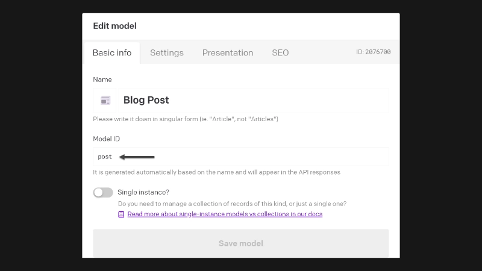
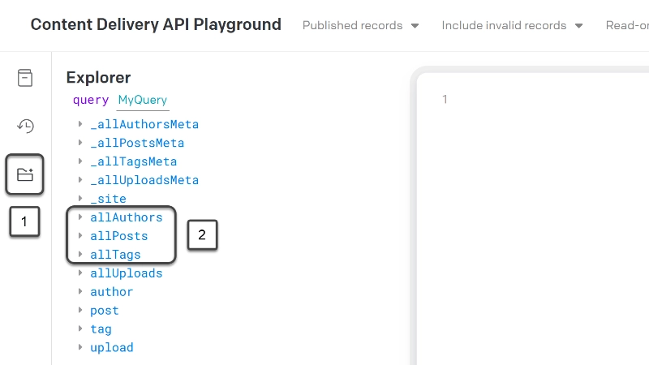
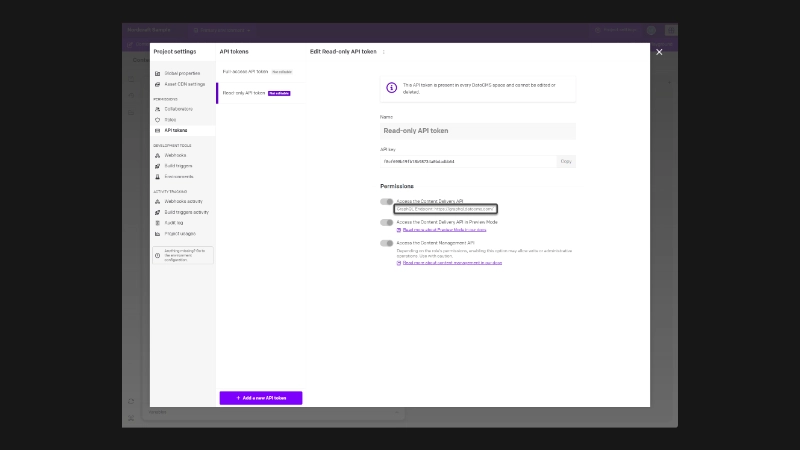
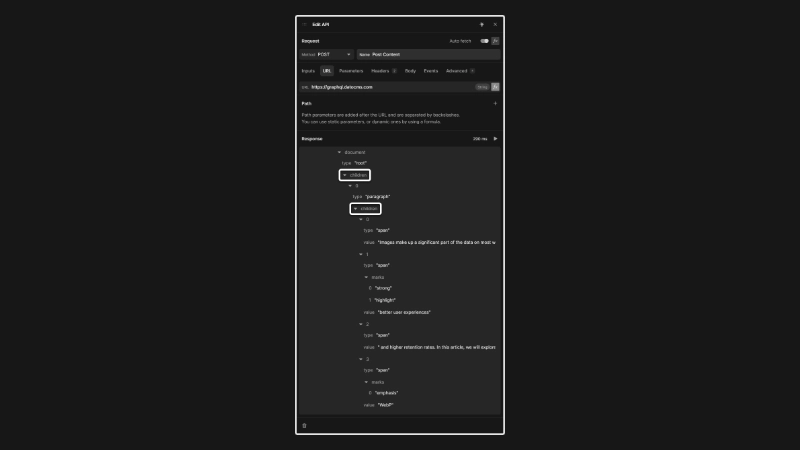
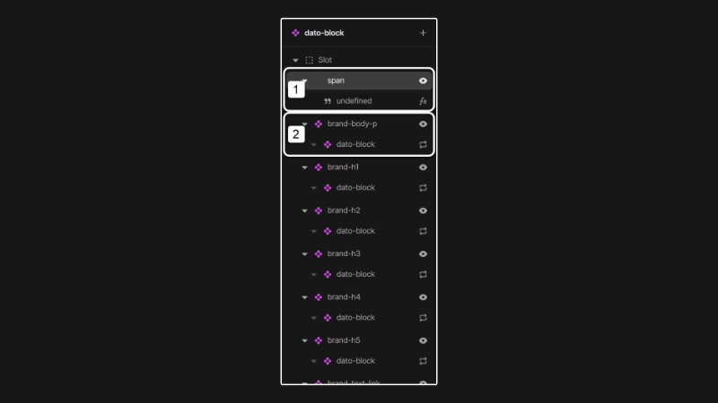
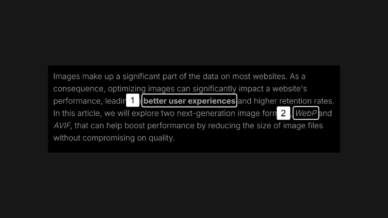
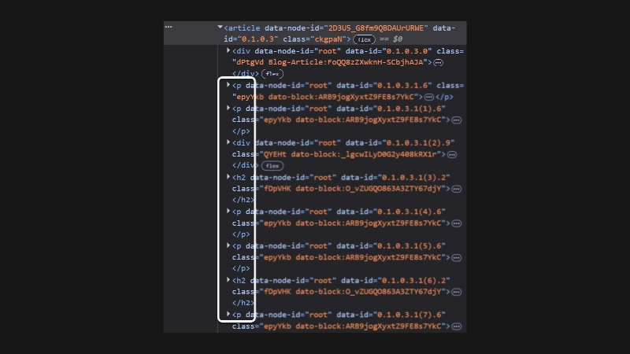
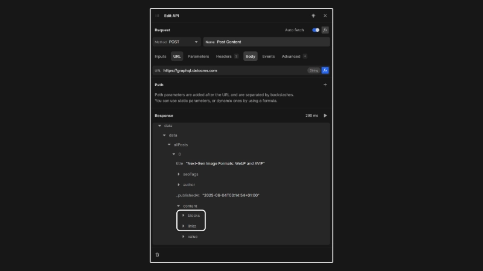

# DatoCMS Integration Guide

DatoCMS is a headless Content Management System (CMS) that lets you store and manage content, and retrieve that content via a GraphQL API for use in your front-end applications. This guide outlines the process of creating a data model within DatoCMS and integrating it with Nordcraft.

### Source Projects

Clone the projects below to your DatoCMS and Nordcraft accounts to follow along with this guide:

*   [DatoCMS Sample Project](https://dashboard.datocms.com/clone?projectId=161783&name=Nordcraft%20Sample)
*   [Nordcraft Sample Project](https://editor.nordcraft.com/projects/datocms_starter/branches/main)

### What is covered

* Models and Blocks in DatoCMS
* Creating our API queries and calls
* Iterating over the data and displaying the content

## Setting up DatoCMS

In DatoCMS, **Models** and **Blocks** are the core of all content.

**Models** function similarly to database tables. They consist of **Fields**, which correspond to database columns, and collectively define the structure of content. Each Model provides a blueprint for creating **Records**, which are the actual content entities, such as pages, blog posts, or product listings. Models can also establish relationships by referencing other models.

**Blocks** represent dynamic and flexible components designed for embedding within Records or Models. For example, an **Image Block** or a **Call-to-Action Block** can be inserted into specific fields of a blog post Record, allowing you to create rich and modular content.

Consider a “Blog Post” record. Its structure might include:

1. **Model:** "Blog Post"
   - **Fields:** Title, Structured Text, Author (referencing an "Author" model), Slug
2. **Blocks:** Image, Gallery, Video, Newsletter Signup CTA

::: tip
For more detailed information, check out the [DatoCMS Documentation on General Concepts](https://www.datocms.com/docs/general-concepts/data-modelling).
:::

## Pulling Data Into Nordcraft

When you have cloned the provided sample project into a DatoCMS account, you can access the project dashboard to review the data.

All posts are located under the “Content” tab within the “Blog” content category, alongside the “tags” model. These tags will be used to implement a simple filter in the Nordcraft project.

Under the “Schema” tab, you can view the Models and Blocks for the project to understand their Field configurations.

Note the “Blog Post” model and note its Model ID: “posts”. This ID will be referenced later for data fetching.



You can access the “CDA Playground” from the top right of the navigation bar in DataCMS. You can use this environment to test the Content Delivery API to preview data before you use it in your Nordcraft project.

You can familiarize yourself with DatoCMS API naming conventions and data structure by exploring the “GraphQL Explorer” (1) in DatoCMS.

To begin, construct a query to fetch a list of blogs. You can use the GraphQL Explorer to view the available data types. Note the three Models in the explorer’s category list (2):



The data types are derived from the Model IDs mentioned previously. Adopting clean and consistent naming conventions is advised to ensure API usability.

Next, build a query to fetch data for a list of blog posts, which will be displayed in a grid. Click on ‘allPosts’ to reveal a list of available data points for posts. A key advantage of a GraphQL API is that it lets you precisely define the data you want to fetch.

For the blog card that will be displayed in the grid, you only need a subset of these data points. Use the following GraphQL query:

```graphql
{
  allPosts(orderBy: _createdAt_DESC) {
    title
    slug
    tags {
      tag
    }
    seoTags {
      image {
        url
        alt
      }
    }
  }
}
```

This query sorts data by creation date (descending) and retrieves titles, URL slugs, associated tags, and featured images, which will be used to create a basic blog card.

To test this in a Nordcraft project, you need to find your DatoCMS API credentials.

From the DatoCMS dashboard, navigate to "Project Settings" in the top-right corner. Within this modal, select the "API Tokens" tab and then access the "Read-Only API Token". This token will be used for secure data retrieval in Nordcraft.

::: info
This read-only API token is safe to use in your Nordcraft project and will not compromise the security of your application. For more information on secure apps, check out the [Security Guide](/guides/security).
:::

Open your Nordcraft project in a separate browser tab or window. It is recommended you set these credentials through global formulas in Nordcraft, which allows you to update these values centrally, should they change in the future.

::: tip
Refer to the documentation on [Global Formulas](/formulas/global-formulas) for additional information.
:::

Create a global formula for the DatoCMS Read-only API key and another for the URL, which is `https://graphql.datocms.com/`.



### Creating an API call in Nordcraft

With the credentials configured, you can create your first API call.

On the blog page in your Nordcraft project, add a new API and use the global formulas set in the previous step for the read-only API key and the URL. Send the API key as a `Bearer Authorization` HTTP header.

::: info
Currently, the Nordcraft team is developing an enhanced UI for GraphQL API calls. For now, you can fetch data from a GraphQL API by adding the query string as an object. The key is "query" and the value is the query string. Look at the Nordcraft example project's API calls in this guide for examples.

Keep up to date with the [Nordcraft GraphQL explorer release on GitHub](https://github.com/nordcraftengine/nordcraft/issues/308).
:::

Create a second GraphQL API call for the tag filter functionality. The query for this call is:

```graphql
{
  allTags {
    tag
  }
}
```

You have now set up two API calls to fetch the necessary data to create a repeating grid for blog cards and a straightforward tag filter.

While detailed design aspects are outside the scope of this guide, the blog card is typically an `<a>` tag wrapping content, using the **slug** from the API call for its `href` attribute.

Tag filter buttons are repeated based on the tags fetched in the second API call. These buttons will set a variable used to filter the repeating blog cards via the "filterByTag" formula.

The layout consists of two repeated elements. You could also create components for the blog card, but for smaller projects where elements are not reused, this may not be necessary. In typical development, however, building these as components is common practice.

::: tip
Useful resources:
- [Repeating elements](formulas/repeat-formula)
- [Understanding when to use components](guides/component-creation)
:::

## Creating the Article Page

The article page requires two primary configurations: fetching the complete blog post data and setting up the repeating block component.

On the article page in Nordcraft, create a page parameter named **slug**.

The blog post’s slug, which serves as a unique identifier for each article, will be used to format the query.

The final query should be structured as follows:

```graphql
{
  allPosts(filter: {slug: {eq: "nextgen-image-formats-webp-and-avif"}}) {
    title
    seoTags {
      image {
        url
        alt
      }
    }
    author {
      name
      picture {
        url
      }
      bio
    }
    _publishedAt
    content {
      blocks {
        id
        image {
          id
          alt
          url
        }
      }
      links {
        id
        slug
        title
      }
      value
    }
  }
}
```

This query retrieves the article's title, main image, author profile, and content.

Now, examine the **dato-block** component, which is a recursive component iterating over the article's content.

### Recursive Content Component

Recursion is when a process calls itself to solve smaller or "nested" versions of the same problem until an end or **base case** is reached. It is useful for things like tree traversals or, in this case, looping through the content array and its nested arrays to display the data as a blog article.

Recursive components cans sometimes be challenging to conceptualize so here is a breakdown of the functionality.

To understand its setup, first review the content data:



The initial “children” array is the target for repeating the **dato-block** component. Note that its first index item also contains its own “children” array.

This structure is typical for headless CMS systems, with minor variations across platforms. The purpose of this nesting is to separate and format inline elements such as bold text or links, as shown in the paragraph example.

::: info
Some CMS platforms return regular HTML, but JSON is seen more often. JSON is much easier to work with on the front end, as it allows you to fully customise the HTML structure of your application.
:::

In the example above, the content includes regular text, bold text, another segment of regular text, and italics. These inline elements form the complete paragraph, and it is these nested children elements that the component iterates over (2). This is the "nested" problem that we are solving, a chain of arrays (elements) with their own child arrays (inline elements).

All nested children elements share a common "value" property. This property is utilized by the first element in the dato-block component (1):



And this property is the point where the recursion ends for each item (**base case**).

In summary, the "parent" **dato-block** component on the "Blog Article" page iterates over the entire article content retrieved from the API call. Subsequently, the component itself iterates over each block's children, rendering the appropriate inline elements for that block.



Given the predictable data structure from DatoCMS, a component can be configured for each element type (for example `h1`, `h2`, `h3`, `p`).

Once this structure is in place, the appropriate show/hide conditions are set for each block (e.g., node type equals paragraph).

Since the root of this component is a `<slot>`, the resulting HTML output remains clean, avoiding excessive nested `div` elements.



## Blocks

Finally, here is how to handle "Blocks" and blog post reference links within the data.

Examine this segment of the article API query:

```graphql
content {
      blocks {
        id
        image {
          id
          alt
          url
        }
      }
      links {
        id
        slug
        title
      }
      value
    }
```

Note the **blocks** and **links** objects. These are defined within the blog post model's Content "Structured Text" field in DatoCMS.

They enable the injection of inline blocks such as images, videos, or galleries, as well as references to other blog posts directly within the content.

These elements are returned separately from the main content in the API call:



And are referenced within the content by their respective IDs:


Therefore, a filter formula can be used to assign the corresponding asset to these inline elements (e.g., images, links).

No additional repeating or recursive components are required for this configuration. The block and link data are simply passed, and the **dato-block** component manages their sorting as needed.

You can now continue to build your application using the cloned project in this guide, or start a new project to fetch data from your DatoCMS account.
